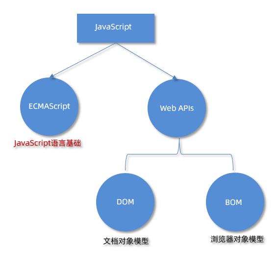
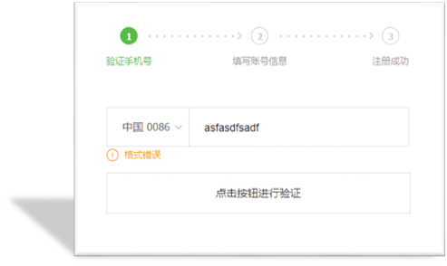

# JavaScript 基础 - 第1天

> 了解变量、数据类型、运算符等基础概念，能够实现数据类型的转换，结合四则运算体会如何编程。

- 体会现实世界中的事物与计算机的关系
- 理解什么是数据并知道数据的分类
- 理解变量存储数据的“容器”
- 掌握常见运算符的使用，了解优先级关系
- 知道 JavaScript 数据类型隐式转换的特征

## 介绍

> 掌握 JavaScript 的引入方式，初步认识 JavaScript 的作用

### 引入方式

JavaScript 程序不能独立运行，它需要被嵌入 HTML 中，然后浏览器才能执行 JavaScript 代码。通过 `script` 标签将 JavaScript 代码引入到 HTML 中，有两种方式：

### 内部方式

通过 `script` 标签包裹 JavaScript 代码

```html
<!DOCTYPE html>
<html lang="en">
<head>
  <meta charset="UTF-8">
  <title>JavaScript 基础 - 引入方式</title>
</head>
<body>
  <!-- 内联形式：通过 script 标签包裹 JavaScript 代码 -->
  <script>
    alert('嗨，欢迎来传智播学习前端技术！')
  </script>
</body>
</html>
```

### 外部形式

一般将 JavaScript 代码写在独立的以 .js 结尾的文件中，然后通过 `script` 标签的 `src` 属性引入

```jsx
// demo.js
document.write('嗨，欢迎来传智播学习前端技术！')
```

```html
<!DOCTYPE html>
<html lang="en">
<head>
  <meta charset="UTF-8">
  <title>JavaScript 基础 - 引入方式</title>
</head>
<body>
  <!-- 外部形式：通过 script 的 src 属性引入独立的 .js 文件 -->
  <script src="demo.js></script>
</body>
</html>
```

如果 script 标签使用 src 属性引入了某 .js 文件，那么 标签的代码会被忽略！！！如下代码所示：

```html
<!DOCTYPE html>
<html lang="en">
<head>
  <meta charset="UTF-8">
  <title>JavaScript 基础 - 引入方式</title>
</head>
<body>
  <!-- 外部形式：通过 script 的 src 属性引入独立的 .js 文件 -->
  <script src="demo.js">
    // 此处的代码会被忽略掉！！！！
  	alert(666);  
  </script>
</body>
</html>
```

### 注释和结束符

通过注释可以屏蔽代码被执行或者添加备注信息，JavaScript 支持两种形式注释语法：

### 单行注释

使用 `//` 注释单行代码

```html
<!DOCTYPE html>
<html lang="en">
<head>
  <meta charset="UTF-8">
  <title>JavaScript 基础 - 注释</title>
</head>
<body>
  
  <script>
    // 这种是单行注释的语法
    // 一次只能注释一行
    // 可以重复注释
    document.write('嗨，欢迎来传智播学习前端技术！');
  </script>
</body>
</html>
```

### 多行注释

使用 `/* */` 注释多行代码

```html
<!DOCTYPE html>
<html lang="en">
<head>
  <meta charset="UTF-8">
  <title>JavaScript 基础 - 注释</title>
</head>
<body>
  
  <script>
    /* 这种的是多行注释的语法 */
    /*
    	更常见的多行注释是这种写法
    	在些可以任意换行
    	多少行都可以
      */
    document.write('嗨，欢迎来传智播学习前端技术！')
  </script>
</body>
</html>
```

**注：编辑器中单行注释的快捷键为 `ctrl + /`**

### 结束符

在 JavaScript 中 `;` 代表一段代码的结束，多数情况下可以省略 `;` 使用回车（enter）替代。

```html
<!DOCTYPE html>
<html lang="en">
<head>
  <meta charset="UTF-8">
  <title>JavaScript 基础 - 结束符</title>
</head>
<body>
  
  <script> 
    alert(1);
    alert(2);
    alert(1)
    alert(2)
  </script>
</body>
</html>
```

实际开发中有许多人主张书写 JavaScript 代码时省略结束符 `;`

### 输入和输出

输出和输入也可理解为人和计算机的交互，用户通过键盘、鼠标等向计算机输入信息，计算机处理后再展示结果给用户，这便是一次输入和输出的过程。

举例说明：如按键盘上的方向键，向上/下键可以滚动页面，按向上/下键这个动作叫作输入，页面发生了滚动了这便叫输出。

### 输出

JavaScript 可以接收用户的输入，然后再将输入的结果输出：

`alert()`、`document.wirte()`

以数字为例，向 `alert()` 或 `document.write()`输入任意数字，他都会以弹窗形式展示（输出）给用户。

### 输入

向 `prompt()` 输入任意内容会以弹窗形式出现在浏览器中，一般提示用户输入一些内容。

```html
<!DOCTYPE html>
<html lang="en">
<head>
  <meta charset="UTF-8">
  <title>JavaScript 基础 - 输入输出</title>
</head>
<body>
  
  <script> 
    // 1. 输入的任意数字，都会以弹窗形式展示
    document.write('要输出的内容')
    alert('要输出的内容');

    // 2. 以弹窗形式提示用户输入姓名，注意这里的文字使用英文的引号
    prompt('请输入您的姓名:')
  </script>
</body>
</html>
```

## 变量

> 理解变量是计算机存储数据的“容器”，掌握变量的声明方式

变量是计算机中用来存储数据的“容器”，它可以让计算机变得有记忆，通俗的理解变量就是使用【某个符号】来代表【某个具体的数值】（数据）

```html
<script>
  // x 符号代表了 5 这个数值
  x = 5
  // y 符号代表了 6 这个数值
  y = 6
    
  //举例： 在 JavaScript 中使用变量可以将某个数据（数值）记录下来！

  // 将用户输入的内容保存在 num 这个变量（容器）中
  num = prompt('请输入一数字!')

  // 通过 num 变量（容器）将用户输入的内容输出出来
  alert(num)
  document.write(num)
</script>
```

### 声明

声明(定义)变量有两部分构成：声明关键字、变量名（标识）

```html
<!DOCTYPE html>
<html lang="en">
<head>
  <meta charset="UTF-8">
  <title>JavaScript 基础 - 声明和赋值</title>
</head>
<body>
  
  <script> 
    // let 变量名
    // 声明(定义)变量有两部分构成：声明关键字、变量名（标识）
    // let 即关键字，所谓关键字是系统提供的专门用来声明（定义）变量的词语
    // age 即变量的名称，也叫标识符
    let age
  </script>
</body>
</html
```

关键字是 JavaScript 中内置的一些英文词汇（单词或缩写），它们代表某些特定的含义，如 `let` 的含义是声明变量的，看到 `let` 后就可想到这行代码的意思是在声明变量，如 `let age;`

`let` 和 `var` 都是 JavaScript 中的声明变量的关键字，推荐使用 `let` 声明变量！！！

### 赋值

声明（定义）变量相当于创造了一个空的“容器”，通过赋值向这个容器中添加数据。

```html
<!DOCTYPE html>
<html lang="en">
<head>
  <meta charset="UTF-8">
  <title>JavaScript 基础 - 声明和赋值</title>
</head>
<body>
  
  <script> 
    // 声明(定义)变量有两部分构成：声明关键字、变量名（标识）
    // let 即关键字，所谓关键字是系统提供的专门用来声明（定义）变量的词语
    // age 即变量的名称，也叫标识符
    let age
    // 赋值，将 18 这个数据存入了 age 这个“容器”中
    age = 18
    // 这样 age 的值就成了 18
    document.write(age)
    
    // 也可以声明和赋值同时进行
    let str = 'hello world!'
    alert(str);
  </script>
</body>
</html>
```

### 关键字

JavaScript 使用专门的关键字 `let` 和 `var` 来声明（定义）变量，在使用时需要注意一些细节：

以下是使用 `let` 时的注意事项：

1. 允许声明和赋值同时进行
2. 不允许重复声明
3. 允许同时声明多个变量并赋值
4. JavaScript 中内置的一些关键字不能被当做变量名

以下是使用 `var` 时的注意事项：

1. 允许声明和赋值同时进行
2. 允许重复声明
3. 允许同时声明多个变量并赋值

大部分情况使用 `let` 和 `var` 区别不大，但是 `let` 相较 `var` 更严谨，因此推荐使用 `let`，后期会更进一步介绍二者间的区别。

### 数组的基本使用

```jsx
let arr = [10,20]
// 1. 声明数组 有序 
let arr = ['刘德华', '张学友', '黎明', '郭富城', 'pink老师', 10]

// 2. 使用数组  数组名[索引号] 从0
    // console.log(arr)
    console.log(arr[0]) // 刘德华

// 3. 数组长度 =  索引号 + 1 
    console.log(arr.length
```

### 变量名命名规则

关于变量的名称（标识符）有一系列的规则需要遵守：

1. 只能是字母、数字、下划线、$，且不能能数字开头
2. 字母区分大小写，如 Age 和 age 是不同的变量
3. JavaScript 内部已占用于单词（关键字或保留字）不允许使用
4. 尽量保证变量具有一定的语义，见字知义

注：所谓关键字是指 JavaScript 内部使用的词语，如 `let` 和`var`，保留字是指 JavaScript 内部目前没有使用的词语，但是将来可能会使用词语。

```html
<!DOCTYPE html>
<html lang="en">
<head>
  <meta charset="UTF-8">
  <title>JavaScript 基础 - 变量名命名规则</title>
</head>
<body>
  
  <script> 
    let age = 18 // 正确
    let age1 = 18 // 正确
    let _age = 18 // 正确

    // let 1age = 18; // 错误，不可以数字开头
    let $age = 18 // 正确
    let Age = 24 // 正确，它与小写的 age 是不同的变量
    // let let = 18; // 错误，let 是关键字
    let int = 123 // 不推荐，int 是保留字
  </script>
</body>
</html>
```

## 常量

概念：使用 const 声明的变量称为“常量”。

使用场景：当某个变量永远不会改变的时候，就可以使用 const 来声明，而不是let。

命名规范：和变量一致

```jsx
const PI = 3.14
```

> 注意： 常量不允许重新赋值,声明的时候必须赋值（初始化）

## 数据类型

> 计算机世界中的万事成物都是数据。

计算机程序可以处理大量的数据，为了方便数据的管理，将数据分成了不同的类型：

注：通过 typeof 关键字检测数据类型

```html
<!DOCTYPE html>
<html lang="en">
<head>
  <meta charset="UTF-8">
  <title>JavaScript 基础 - 数据类型</title>
</head>
<body>
  
  <script> 
    // 检测 1 是什么类型数据，结果为 number
    document.write(typeof 1)
  </script>
</body>
</html>
```

### 数值类型

即我们数学中学习到的数字，可以是整数、小数、正数、负数

```html
<!DOCTYPE html>
<html lang="en">
<head>
  <meta charset="UTF-8">
  <title>JavaScript 基础 - 数据类型</title>
</head>
<body>
  
  <script> 
    let score = 100 // 正整数
    let price = 12.345 // 小数
    let temperature = -40 // 负数

    document.write(typeof score) // 结果为 number
    document.write(typeof price) // 结果为 number
    document.write(typeof temperature) // 结果为 number
  </script>
</body>
</html>
```

JavaScript 中的数值类型与数学中的数字是一样的，分为正数、负数、小数等。

### 字符串类型

通过单引号（ `''`） 、双引号（ `""`）或反引号包裹的数据都叫字符串，单引号和双引号没有本质上的区别，推荐使用单引号。

注意事项：

1. 无论单引号或是双引号必须成对使用
2. 单引号/双引号可以互相嵌套，但是不以自已嵌套自已
3. 必要时可以使用转义符 `\`，输出单引号或双引号

```html
<!DOCTYPE html>
<html lang="en">
<head>
  <meta charset="UTF-8">
  <title>JavaScript 基础 - 数据类型</title>
</head>
<body>
  
  <script> 
    let user_name = '小明' // 使用单引号
    let gender = "男" // 使用双引号
    let str = '123' // 看上去是数字，但是用引号包裹了就成了字符串了
    let str1 = '' // 这种情况叫空字符串
		
    documeent.write(typeof user_name) // 结果为 string
    documeent.write(typeof gender) // 结果为 string
    documeent.write(typeof str) // 结果为 string
  </script>
</body>
</html>
```

### 模板字符串

### 使用场景

拼接字符串和变量

```jsx
document.write('大家好，我叫'+name+',今年'+ age + '岁')
```

### 语法

``反引号

tab键上方

内容拼接变量时，用${}包裹住变量

```jsx
document.write(`大家好，我叫${uname},我今年贵庚${age}岁了`)
```

### 布尔类型

表示肯定或否定时在计算机中对应的是布尔类型数据，它有两个固定的值 `true` 和 `false`，表示肯定的数据用 `true`，表示否定的数据用 `false`。

```html
<!DOCTYPE html>
<html lang="en">
<head>
  <meta charset="UTF-8">
  <title>JavaScript 基础 - 数据类型</title>
</head>
<body>
  
  <script> 
    //  pink老师帅不帅？回答 是 或 否
    let isCool = true // 是的，摔死了！
    isCool = false // 不，套马杆的汉子！

    document.write(typeof isCool) // 结果为 boolean
  </script>
</body>
</html>
```

### undefined

未定义是比较特殊的类型，只有一个值 undefined，只声明变量，不赋值的情况下，变量的默认值为 undefined，一般很少【直接】为某个变量赋值为 undefined。

```html
<!DOCTYPE html>
<html lang="en">
<head>
  <meta charset="UTF-8">
  <title>JavaScript 基础 - 数据类型</title>
</head>
<body>
  
  <script> 
    // 只声明了变量，并末赋值
    let tmp;
    document.write(typeof tmp) // 结果为 undefined
  </script>
</body>
</html>
```

**注：JavaScript 中变量的值决定了变量的数据类型。**

### Null空值

```jsx
let obj = null  // console.log(obj)
```

## 类型转换

> 理解弱类型语言的特征，掌握显式类型转换的方法

在 JavaScript 中数据被分成了不同的类型，如数值、字符串、布尔值、undefined，在实际编程的过程中，不同数据类型之间存在着转换的关系。

### 隐式转换

某些运算符被执行时，系统内部自动将数据类型进行转换，这种转换称为隐式转换。

```html
<!DOCTYPE html>
<html lang="en">
<head>
  <meta charset="UTF-8">
  <title>JavaScript 基础 - 隐式转换</title>
</head>
<body>
  <script> 
    let num = 13 // 数值
    let num2 = '2' // 字符串

    // 结果为 132
    // 原因是将数值 num 转换成了字符串，相当于 '13'
    // 然后 + 将两个字符串拼接到了一起
    console.log(num + num2)

    // 结果为 11
    // 原因是将字符串 num2 转换成了数值，相当于 2
    // 然后数值 13 减去 数值 2
    console.log(num - num2)

    let a = prompt('请输入一个数字')
    let b = prompt('请再输入一个数字')

    alert(a + b);
  </script>
</body>
</html
```

注：数据类型的隐式转换是 JavaScript 的特征，后续学习中还会遇到，目前先需要理解什么是隐式转换。

补充介绍模板字符串的拼接的使用

### 显式转换

编写程序时过度依靠系统内部的隐式转换是不严禁的，因为隐式转换规律并不清晰，大多是靠经验总结的规律。为了避免因隐式转换带来的问题，通常根逻辑需要对数据进行显示转换。

### Number

通过 `Number` 显示转换成数值类型，当转换失败时结果为 `NaN`（Not a Number）即不是一个数字。

```html
<!DOCTYPE html>
<html lang="en">
<head>
  <meta charset="UTF-8">
  <title>JavaScript 基础 - 隐式转换</title>
</head>
<body>
  <script>
    let t = '12'
    let f = 8

    // 显式将字符串 12 转换成数值 12
    t = Number(t)

    // 检测转换后的类型
    // console.log(typeof t);
    console.log(t + f) // 结果为 20

    // 并不是所有的值都可以被转成数值类型
    let str = 'hello'
    // 将 hello 转成数值是不现实的，当无法转换成
    // 数值时，得到的结果为 NaN （Not a Number）
    console.log(Number(str))
  </script>
</body>
</html>
```

# JavaScript 基础 - 第2天

> 理解什么是流程控制，知道条件控制的种类并掌握其对应的语法规则，具备利用循环编写简易ATM取款机程序能力

- 运算符
- 语句
- 综合案例

## 运算符

### 算术运算符

数字是用来计算的，比如：乘法 * 、除法 / 、加法 + 、减法 - 等等，所以经常和算术运算符一起。

算术运算符：也叫数学运算符，主要包括加、减、乘、除、取余（求模）等

| 运算符 | 作用                                                 |
| ------ | ---------------------------------------------------- |
| +      | 求和                                                 |
| -      | 求差                                                 |
| *      | 求积                                                 |
| /      | 求商                                                 |
| %      | 取模（取余数），开发中经常用于作为某个数字是否被整除 |

> 注意：在计算失败时，显示的结果是 **NaN** （not a number）

```jsx
// 算术运算符
console.log(1 + 2 * 3 / 2) //  4 
let num = 10
console.log(num + 10)  // 20
console.log(num + num)  // 20

// 1. 取模(取余数)  
//使用场景:用来判断某个数是否能够被整除
console.log(4 % 2) //  0  
console.log(6 % 3) //  0
console.log(5 % 3) //  2
console.log(3 % 5) //  3

// 2. 注意事项:如果我们计算失败，
//则返回的结果是 NaN (not a number)
console.log('pink老师' - 2)
console.log('pink老师' * 2)
console.log('pink老师' + 2)   // pink老师2
```

### 赋值运算符

赋值运算符：对变量进行赋值的运算符

= 将等号右边的值赋予给左边, 要求左边必须是一个容器

| 运算符 | 作用     |
| ------ | -------- |
| +=     | 加法赋值 |
| -=     | 减法赋值 |
| *=     | 乘法赋值 |
| /=     | 除法赋值 |
| %=     | 取余赋值 |

```jsx
<script>
let num = 1
// num = num + 1
// 采取赋值运算符
// num += 1
num += 3
console.log(num)
</script>
```

### 自增/自减运算符

| 符号 | 作用 | 说明                        |
| ---- | ---- | --------------------------- |
| ++   | 自增 | 变量自身的值加1，例如: x++  |
| - -  | 自减 | 变量自身的值减1，例如: x- - |

1. ++在前和++在后在单独使用时二者并没有差别，而且一般开发中我们都是独立使用
2. ++在后（后缀式）我们会使用更多

> 注意：
>
> 1. 只有变量能够使用自增和自减运算符
> 1. ++、– 可以在变量前面也可以在变量后面，比如: x++ 或者 ++x

```jsx
<script>
    // let num = 10
    // num = num + 1
    // num += 1
    // // 1. 前置自增
    // let i = 1
    // ++i
    // console.log(i)

    // let i = 1
    // console.log(++i + 1)
    // 2. 后置自增
    // let i = 1
    // i++
    // console.log(i)
    // let i = 1
    // console.log(i++ + 1)

    // 了解 
    let i = 1
    console.log(i++ + ++i + i)
  </script>
```

### 比较运算符

使用场景：比较两个数据大小、是否相等，根据比较结果返回一个布尔值（true / false）

| 运算符 | 作用                               |
| ------ | ---------------------------------- |
| >      | 左边是否大于右边                   |
| <      | 左边是否小于右边                   |
| >=     | 左边是否大于或等于右边             |
| <=     | 左边是否小于或等于右边             |
| ===    | 左右两边是否类型和值都相等（重点） |
| ==     | 左右两边值是否相等                 |
| !=     | 左右值不相等                       |
| !==    | 左右两边是否不全等                 |

```jsx
<script>
  console.log(3 > 5)
  console.log(3 >= 3)
  console.log(2 == 2)
  // 比较运算符有隐式转换 把'2' 转换为 2  双等号 只判断值
  console.log(2 == '2')  // true
  // console.log(undefined === null)
  // === 全等 判断 值 和 数据类型都一样才行
  // 以后判断是否相等 请用 ===  
  console.log(2 === '2')
  console.log(NaN === NaN) // NaN 不等于任何人，包括他自己
  console.log(2 !== '2')  // true  
  console.log(2 != '2') // false 
  console.log('-------------------------')
  console.log('a' < 'b') // true
  console.log('aa' < 'ab') // true
  console.log('aa' < 'aac') // true
  console.log('-------------------------')
</script>
```

### 逻辑运算符

使用场景：可以把多个布尔值放到一起运算，最终返回一个布尔值

| 符号 | 名称   | 日常读法 | 特点                       | 口诀           |
| ---- | ------ | -------- | -------------------------- | -------------- |
| &&   | 逻辑与 | 并且     | 符号两边有一个假的结果为假 | 一假则假       |
|      |        |          | 逻辑或                     | 或者           |
| !    | 逻辑非 | 取反     | true变false false变true    | 真变假，假变真 |

| A     | B     | A && B | A \|\|B | !A    |
| ----- | ----- | ------ | ------- | ----- |
| false | false | false  | false   | true  |
| false | true  | false  | true    | true  |
| true  | false | false  | true    | false |
| true  | true  | true   | true    | false |

```jsx
<script>
    // 逻辑与 一假则假
    console.log(true && true)
    console.log(false && true)
    console.log(3 < 5 && 3 > 2)
    console.log(3 < 5 && 3 < 2)
    console.log('-----------------')
    // 逻辑或 一真则真
    console.log(true || true)
    console.log(false || true)
    console.log(false || false)
    console.log('-----------------')
    // 逻辑非  取反
    console.log(!true)
    console.log(!false)

    console.log('-----------------')

    let num = 6
    console.log(num > 5 && num < 10)
    console.log('-----------------')
  </script>
```

### 运算符优先级

| 优先级 | 运算符     | 顺序                |
| ------ | ---------- | ------------------- |
| 1      | 小括号     | ()                  |
| 2      | 一元运算符 | ++ -- !             |
| 3      | 算数运算符 | 先* / % 后 + -      |
| 4      | 关系运算符 | >  >=  <  <+        |
| 5      | 相等运算符 | ==   !=   ===   !== |
| 6      | 逻辑运算符 | 先&&    后  \|\|    |
| 7      | 赋值运算符 | =                   |
| 8      | 逗号运算符 | ,                   |

> 逻辑运算符优先级： ！> && > ||

## 语句

### 表达式和语句


### 分支语句

分支语句可以根据条件判定真假，来选择性的执行想要的代码

分支语句包含：

1. if分支语句（重点）
2. 三元运算符
3. switch语句

### if 分支语句

语法：

```jsx
if(条件表达式) {
  // 满足条件要执行的语句
}
```

小括号内的条件结果是布尔值，为 true 时，进入大括号里执行代码；为false，则不执行大括号里面代码

小括号内的结果若不是布尔类型时，会发生类型转换为布尔值，类似Boolean()

如果大括号只有一个语句，大括号可以省略，但是，不提倡这么做

```jsx
<script>
    // 单分支语句
    // if (false) {
    //   console.log('执行语句')
    // }
    // if (3 > 5) {
    //   console.log('执行语句')
    // }
    // if (2 === '2') {
    //   console.log('执行语句')
    // }
    //  1. 除了0 所有的数字都为真
    //   if (0) {
    //     console.log('执行语句')
    //   }
    // 2.除了 '' 所有的字符串都为真 true
    // if ('pinkpink') {
    //   console.log('执行语句')
    // }
    // if ('') {
    //   console.log('执行语句')
    // }
    // // if ('') console.log('执行语句')

    // 1. 用户输入
    let score = +prompt('请输入成绩')
    // 2. 进行判断输出
    if (score >= 700) {
      alert('恭喜')
    }
    console.log('-----------------')

  </script>
```

### if双分支语句

如果有两个条件的时候，可以使用 if else 双分支语句

```jsx
if (条件表达式){
  // 满足条件要执行的语句
} else {
  // 不满足条件要执行的语句
}
```

例如：

```jsx
 <script>
    // 1. 用户输入
    let uname = prompt('请输入用户名:')
    let pwd = prompt('请输入密码:')
    // 2. 判断输出
    if (uname === 'pink' && pwd === '123456') {
      alert('恭喜登录成功')
    } else {
      alert('用户名或者密码错误')
    }
  </script>
```

### if 多分支语句

使用场景： 适合于有多个条件的时候

```jsx
<script>
    // 1. 用户输入
    let score = +prompt('请输入成绩：')
    // 2. 判断输出
    if (score >= 90) {
      alert('成绩优秀，宝贝，你是我的骄傲')
    } else if (score >= 70) {
      alert('成绩良好，宝贝，你要加油哦~~')
    } else if (score >= 60) {
      alert('成绩及格，宝贝，你很危险~')
    } else {
      alert('成绩不及格，宝贝，我不想和你说话，我只想用鞭子和你说话~')
    }
  </script>
```

### 三元运算符（三元表达式）

**使用场景**： 一些简单的双分支，可以使用 三元运算符（三元表达式），写起来比 if else双分支 更简单

**符号**：? 与 : 配合使用

语法：

```jsx
条件 ? 表达式1 ： 表达式2
```

例如：

```jsx
// 三元运算符（三元表达式）
// 1. 语法格式
// 条件 ? 表达式1 : 表达式2 

// 2. 执行过程 
// 2.1 如果条件为真，则执行表达式1
// 2.2 如果条件为假，则执行表达式2

// 3. 验证
// 5 > 3 ? '真的' : '假的'
console.log(5 < 3 ? '真的' : '假的')

// let age = 18 
// age = age + 1
//  age++

// 1. 用户输入 
let num = prompt('请您输入一个数字:')
// 2. 判断输出- 小于10才补0
// num = num < 10 ? 0 + num : num
num = num >= 10 ? num : 0 + num
alert(num)
```

### switch语句（了解）

使用场景： 适合于有多个条件的时候，也属于分支语句，大部分情况下和 if多分支语句 功能相同

注意：

1. switch case语句一般用于等值判断, if适合于区间判断
2. switchcase一般需要配合break关键字使用 没有break会造成case穿透
3. if 多分支语句开发要比switch更重要，使用也更多

例如：

```jsx
// switch分支语句
// 1. 语法
// switch (表达式) {
//   case 值1:
//     代码1
//     break

//   case 值2:
//     代码2
//     break
//   ...
//   default:
//     代码n
// }

<script>
  switch (2) {
    case 1:
    console.log('您选择的是1')
    break  // 退出switch
    case 2:
    console.log('您选择的是2')
    break  // 退出switch
    case 3:
    console.log('您选择的是3')
    break  // 退出switch
    default:
    console.log('没有符合条件的')
  }
</script>
```

### 断点调试

**作用：**学习时可以帮助更好的理解代码运行，工作时可以更快找到bug

浏览器打开调试界面

1. 按F12打开开发者工具
2. 点到源代码一栏 （ sources ）
3. 选择代码文件

**断点：**在某句代码上加的标记就叫断点，当程序执行到这句有标记的代码时会暂停下来

### 循环语句

使用场景：重复执行 指定的一段代码，比如我们想要输出10次 ‘我学的很棒’

学习路径：

1.while循环

2.for 循环（重点）

### while循环

while : 在…. 期间， 所以 while循环 就是在满足条件期间，重复执行某些代码。

**语法：**

```jsx
while (条件表达式) {
   // 循环体    
}
```

例如：

```jsx
// while循环: 重复执行代码

// 1. 需求: 利用循环重复打印3次 '月薪过万不是梦，毕业时候见英雄'
let i = 1
while (i <= 3) {
  document.write('月薪过万不是梦，毕业时候见英雄~<br>')
  i++   // 这里千万不要忘了变量自增否则造成死循环
}
```

循环三要素：

1.初始值 （经常用变量）

2.终止条件

3.变量的变化量

例如：

```jsx
<script>
  // // 1. 变量的起始值
  // let i = 1
  // // 2. 终止条件
  // while (i <= 3) {
  //   document.write('我要循环三次 <br>')
  //   // 3. 变量的变化量
  //   i++
  // }
  // 1. 变量的起始值
  let end = +prompt('请输入次数:')
let i = 1
// 2. 终止条件
while (i <= end) {
  document.write('我要循环三次 <br>')
  // 3. 变量的变化量
  i++
}

</script>
```

### 中止循环

`break` 中止整个循环，一般用于结果已经得到, 后续的循环不需要的时候可以使用（提高效率）

`continue` 中止本次循环，一般用于排除或者跳过某一个选项的时候

```jsx
<script>
    // let i = 1
    // while (i <= 5) {
    //   console.log(i)
    //   if (i === 3) {
    //     break  // 退出循环
    //   }
    //   i++

    // }

    let i = 1
    while (i <= 5) {
      if (i === 3) {
        i++
        continue
      }
      console.log(i)
      i++

    }
  </script>
```

### 无限循环

1.while(true) 来构造“无限”循环，需要使用break退出循环。（常用）

2.for(;;) 也可以来构造“无限”循环，同样需要使用break退出循环。

```jsx
// 无限循环  
// 需求： 页面会一直弹窗询问你爱我吗？
// (1). 如果用户输入的是 '爱'，则退出弹窗
// (2). 否则一直弹窗询问

// 1. while(true) 无限循环
// while (true) {
//   let love = prompt('你爱我吗?')
//   if (love === '爱') {
//     break
//   }
// }

// 2. for(;;) 无限循环
for (; ;) {
  let love = prompt('你爱我吗?')
  if (love === '爱') {
    break
  }
}
```

## 综合案例-ATM存取款机


分析：

①：提示输入框写到循环里面（无限循环）

②：用户输入4则退出循环 break

③：提前准备一个金额预先存储一个数额 money

④：根据输入不同的值，做不同的操作

 (1) 取钱则是减法操作， 存钱则是加法操作，查看余额则是直接显示金额

 (2) 可以使用 if else if 多分支 来执行不同的操作

完整代码：

```jsx
<script>
  // 1. 开始循环 输入框写到 循环里面
  // 3. 准备一个总的金额
  let money = 100
while (true) {
  let re = +prompt(`
        请您选择操作：
        1.存钱
        2.取钱
        3.查看余额
        4.退出
  `)
  // 2. 如果用户输入的 4 则退出循环， break  写到if 里面，没有写到switch里面， 因为4需要break退出循环
  if (re === 4) {
    break
  }
  // 4. 根据输入做操作
  switch (re) {
    case 1:
      // 存钱
      let cun = +prompt('请输入存款金额')
      money = money + cun
      break
      case 2:
      // 存钱
      let qu = +prompt('请输入取款金额')
      money = money - qu
      break
      case 3:
      // 存钱
      alert(`您的银行卡余额是${money}`)
      break
  }
}
</script>
```

# JavaScript 基础第三天笔记

**if 多分支语句和 switch的区别：**

1. 共同点
   - 都能实现多分支选择， 多选1
   - 大部分情况下可以互换
2. 区别：
   - switch…case语句通常处理case为比较**确定值**的情况，而if…else…语句更加灵活，通常用于**范围判断**(大于，等于某个范围)。
   - switch 语句进行判断后直接执行到程序的语句，效率更高，而if…else语句有几种判断条件，就得判断多少次
   - switch 一定要注意 必须是 === 全等，一定注意 数据类型，同时注意break否则会有穿透效果
   - 结论：
     - 当分支比较少时，if…else语句执行效率高。
     - 当分支比较多时，switch语句执行效率高，而且结构更清晰。

## for 语句

> 掌握 for 循环语句，让程序具备重复执行能力

`for` 是 JavaScript 提供的另一种循环控制的话句，它和 `while` 只是语法上存在差异。

### for语句的基本使用

1. 实现循环的 3 要素

```html
<script>
  // 1. 语法格式
  // for(起始值; 终止条件; 变化量) {
  //   // 要重复执行的代码
  // }

  // 2. 示例：在网页中输入标题标签
  // 起始值为 1
  // 变化量 i++
  // 终止条件 i <= 6
  for(let i = 1; i <= 6; i++) {
    document.write(`<h${i}>循环控制，即重复执行<h${i}>`)
  }
</script>
```

1. 变化量和死循环，`for` 循环和 `while` 一样，如果不合理设置增量和终止条件，便会产生死循环。
2. 跳出和终止循环

```html
<script>
    // 1. continue 
    for (let i = 1; i <= 5; i++) {
        if (i === 3) {
            continue  // 结束本次循环，继续下一次循环
        }
        console.log(i)
    }
    // 2. break
    for (let i = 1; i <= 5; i++) {
        if (i === 3) {
            break  // 退出结束整个循环
        }
        console.log(i)
    }
</script>
```

结论：

- `JavaScript` 提供了多种语句来实现循环控制，但无论使用哪种语句都离不开循环的3个特征，即起始值、变化量、终止条件，做为初学者应着重体会这3个特征，不必过多纠结三种语句的区别。
- 起始值、变化量、终止条件，由开发者根据逻辑需要进行设计，规避死循环的发生。
- 当如果明确了循环的次数的时候推荐使用`for`循环,当不明确循环的次数的时候推荐使用`while`循环

> 注意：for 的语法结构更简洁，故 for 循环的使用频次会更多。

### 循环嵌套

 JavaScript 中任何一种循环语句都支持循环的嵌套，如下代码所示：

```jsx
for(外部声明记录循环次数的变量;循环条件;变化值) {
	for(内部声明记录循环次数的变量;循环条件;变化值){
		//循环体
	}
}
```

计算： 假如每天记住5个单词，3天后一共能记住多少单词？

```html
// 1. 外面的循环 记录第n天
for (let i = 1; i < 4; i++) {
    document.write(`第${i}天 <br>`)
    // 2. 里层的循环记录 几个单词
    for (let j = 1; j < 6; j++) {
        document.write(`记住第${j}个单词<br>`)
    }
}
```

记住，外层循环循环一次，里层循环循环全部

### **打印倒三角形星星**

①：利用双重for循环来做

②：外层循环控制打印行，内层循环控制每行打印几个（列）

③：内层循环的个数跟第几行是一一对应的

```jsx
 // 外层打印几行
for (let i = 1; i <= 5; i++) {
    // 里层打印几个星星
    for (let j = 1; j <= i; j++) {
        document.write('★')
    }
    document.write('<br>')
}
```


### 九九乘法表

样式css

```css
span {
    display: inline-block;
    width: 100px;
    padding: 5px 10px;
    border: 1px solid pink;
    margin: 2px;
    border-radius: 5px;
    box-shadow: 2px 2px 2px rgba(255, 192, 203, .4);
    background-color: rgba(255, 192, 203, .1);
    text-align: center;
    color: hotpink;
}
```

JS

```jsx
 // 外层打印几行
for (let i = 1; i <= 9; i++) {
    // 里层打印几个星星
    for (let j = 1; j <= i; j++) {
        // 只需要吧 ★ 换成  1 x 1 = 1   
        document.write(`
		<div> ${j} x ${i} = ${j * i} </div>
     `)
    }
    document.write('<br>')
}
```


## 数组

> 知道什么是数组及其应用的场景，掌握数组声明及访问的语法。

### 数组是什么？

**数组：**(Array)是一种可以按顺序保存数据的数据类型

**使用场景：**如果有多个数据可以用数组保存起来，然后放到一个变量中，管理非常方便

### 数组的基本使用

### 定义数组和数组单元

```html
<script>
  // 1. 语法，使用 [] 来定义一个空数组
  // 定义一个空数组，然后赋值给变量 classes
  // let classes = [];

  // 2. 定义非空数组
  let classes = ['小明', '小刚', '小红', '小丽', '小米']
</script>
```

通过 `[]` 定义数组，数据中可以存放真正的数据，如小明、小刚、小红等这些都是数组中的数据，我们这些数据称为数组单元，数组单元之间使用英文逗号分隔。

### 访问数组和数组索引

使用数组存放数据并不是最终目的，关键是能够随时的访问到数组中的数据（单元）。其实 JavaScript 为数组中的每一个数据单元都编了号，通过数据单元在数组中的编号便可以轻松访问到数组中的数据单元了。

我们将数据单元在数组中的编号称为索引值，也有人称其为下标。

索引值实际是按着数据单元在数组中的位置依次排列的，注意是从`0` 开始的。

```html
<script>
  let classes = ['小明', '小刚', '小红', '小丽', '小米']
  
  // 1. 访问数组，语法格式为：变量名[索引值]
  document.write(classes[0]) // 结果为：小明
  document.write(classes[1]) // 结果为：小刚
  document.write(classes[4]) // 结果为：小米
  
  // 2. 通过索引值还可以为数组单重新赋值
  document.write(classes[3]) // 结果为：小丽
  // 重新为索引值为 3 的单元赋值
  classes[3] = '小小丽'
  document.wirte(classes[3]); // 结果为： 小小丽
</script>
```

### 数据单元值类型

数组做为数据的集合，它的单元值可以是任意数据类型

```html
<script>
  // 6. 数组单值类型可以是任意数据类型

  // a) 数组单元值的类型为字符类型
  let list = ['HTML', 'CSS', 'JavaScript']
  // b) 数组单元值的类型为数值类型
  let scores = [78, 84, 70, 62, 75]
  // c) 混合多种类型
  let mixin = [true, 1, false, 'hello']
</script>
```

### 数组长度属性

重申一次，数组在 JavaScript 中并不是新的数据类型，它属于对象类型。

```html
<script>
  // 定义一个数组
  let arr = ['html', 'css', 'javascript']
  // 数组对应着一个 length 属性，它的含义是获取数组的长度
  console.log(arr.length) // 3
</script>
```

### 操作数组

数组做为对象数据类型，不但有 `length` 属性可以使用，还提供了许多方法：

1. push 动态向数组的尾部添加一个单元
2. unshit 动态向数组头部添加一个单元
3. pop 删除最后一个单元
4. shift 删除第一个单元
5. splice 动态删除任意单元

使用以上4个方法时，都是直接在原数组上进行操作，即成功调任何一个方法，原数组都跟着发生相应的改变。并且在添加或删除单元时 `length` 并不会发生错乱。

```html
<script>
  // 定义一个数组
  let arr = ['html', 'css', 'javascript']

  // 1. push 动态向数组的尾部添加一个单元
  arr.push('Nodejs')
  console.log(arr)
  arr.push('Vue')

  // 2. unshit 动态向数组头部添加一个单元
  arr.unshift('VS Code')
  console.log(arr)

  // 3. splice 动态删除任意单元
  arr.splice(2, 1) // 从索引值为2的位置开始删除1个单元
  console.log(arr)

  // 4. pop 删除最后一个单元
  arr.pop()
  console.log(arr)

  // 5. shift 删除第一个单元
  arr.shift()
  console.log(arr)
</script>
```

splice() 方法用于添加或删除数组中的元素。

**注意：**这种方法会改变原始数组。

1. **删除数组：**

splice(起始位置， 删除的个数)

比如：

```jsx
let arr = ['red', 'green', 'blue']
arr.splice(1,1) // 删除green元素
console.log(arr) // ['red, 'blue']
```

1. **添加元素**

splice(起始位置，删除个数，添加数组元素)

```jsx
let arr = ['red', 'green', 'blue']
//arr.splice(1, 0, 'pink') // 在索引号是1的位置添加 pink
//console.log(arr) // ['red', 'pink', 'green', 'blue']
arr.splice(1, 0, 'pink', 'hotpink') // 在索引号是1的位置添加 pink  hotpink
console.log(arr) // ['red', 'pink', 'hotpink', 'green', 'blue']
```

# JavaScript 基础 - 第4天笔记

> 理解封装的意义，能够通过函数的声明实现逻辑的封装，知道对象数据类型的特征，结合数学对象实现简单计算功能。

- 理解函数的封装的特征
- 掌握函数声明的语法
- 理解什么是函数的返回值
- 知道并能使用常见的内置函数

## 函数

> 理解函数的封装特性，掌握函数的语法规则

### 声明和调用

函数可以把具有相同或相似逻辑的代码“包裹”起来，通过函数调用执行这些被“包裹”的代码逻辑，这么做的优势是有利于精简代码方便复用。

### 声明（定义）

声明（定义）一个完整函数包括关键字、函数名、形式参数、函数体、返回值5个部分


### 调用

声明（定义）的函数必须调用才会真正被执行，使用 `()` 调用函数。

```html
<!DOCTYPE html>
<html lang="en">
<head>
  <meta charset="UTF-8">
  <title>JavaScript 基础 - 声明和调用</title>
</head>
<body>
  <script>
    // 声明（定义）了最简单的函数，既没有形式参数，也没有返回值
    function sayHi() {
      console.log('嗨~')
    }
    // 函数调用，这些函数体内的代码逻辑会被执行
    // 函数名()
        
    sayHi()
    // 可以重复被调用，多少次都可以
    sayHi()
  </script>
</body>
</html>
```

> 注：函数名的命名规则与变量是一致的，并且尽量保证函数名的语义。

小案例： 小星星

```jsx
<script>
        // 函数声明
        function sayHi() {
            // document.write('hai~')
            document.write(`*<br>`)
            document.write(`**<br>`)
            document.write(`***<br>`)
            document.write(`****<br>`)
            document.write(`*****<br>`)
            document.write(`******<br>`)
            document.write(`*******<br>`)
            document.write(`********<br>`)
            document.write(`*********<br>`)
        }
        // 函数调用
        sayHi()
        sayHi()
        sayHi()
        sayHi()
        sayHi()
    </script>
```

### 参数

通过向函数传递参数，可以让函数更加灵活多变，参数可以理解成是一个变量。

声明（定义）一个功能为打招呼的函数

- 传入数据列表
- 声明这个函数需要传入几个数据
- 多个数据用逗号隔开

```html
<!DOCTYPE html>
<html lang="en">
<head>
  <meta charset="UTF-8">
  <title>JavaScript 基础 - 函数参数</title>
</head>
<body>

  <script>
    // 声明（定义）一个功能为打招呼的函数
    // function sayHi() {
    //   console.log('嗨~')
    // }
    // 调用函数
    // sayHi()
	

    // 这个函数似乎没有什么价值，除非能够向不同的人打招呼
    // 这就需要借助参数来实现了
    function sayHi(name) {
      // 参数 name 可以被理解成是一个变量
      console.log(name)
      console.log('嗨~' + name)
    }

    // 调用 sayHi 函数，括号中多了 '小明'
    // 这时相当于为参数 name 赋值了
    sayHi('小明')// 结果为 小明

    // 再次调用 sayHi 函数，括号中多了 '小红'
    // 这时相当于为参数 name 赋值了
    sayHi('小红') // 结果为 小红
  </script>
</body>
</html>
```

总结：

1. 声明（定义）函数时的形参没有数量限制，当有多个形参时使用 `,` 分隔
2. 调用函数传递的实参要与形参的顺序一致

### 形参和实参

形参：声明函数时写在函数名右边小括号里的叫形参（形式上的参数）

实参：调用函数时写在函数名右边小括号里的叫实参（实际上的参数）

形参可以理解为是在这个函数内声明的变量（比如 num1 = 10）实参可以理解为是给这个变量赋值

开发中尽量保持形参和实参个数一致

```html
<!DOCTYPE html>
<html lang="en">
<head>
  <meta charset="UTF-8">
  <title>JavaScript 基础 - 函数参数</title>
</head>
<body>
  <script>
    // 声明（定义）一个计算任意两数字和的函数
    // 形参 x 和 y 分别表示任意两个数字，它们是两个变量
    function count(x, y) {
      console.log(x + y);
    }
    // 调用函数，传入两个具体的数字做为实参
    // 此时 10 赋值给了形参 x
    // 此时 5  赋值给了形参 y
    count(10, 5); // 结果为 15
  </script>
</body>
</html>
```

### 返回值

函数的本质是封装（包裹），函数体内的逻辑执行完毕后，函数外部如何获得函数内部的执行结果呢？要想获得函数内部逻辑的执行结果，需要通过 `return` 这个关键字，将内部执行结果传递到函数外部，这个被传递到外部的结果就是返回值。

```html
<!DOCTYPE html>
<html lang="en">
<head>
  <meta charset="UTF-8">
  <title>JavaScript 基础 - 函数返回值</title>
</head>
<body>

  <script>
    // 定义求和函数
    function count(a, b) {
      let s = a + b
      // s 即为 a + b 的结果
      // 通过 return 将 s 传递到外部
      return s
    }

    // 调用函数，如果一个函数有返回值
    // 那么可将这个返回值赋值给外部的任意变量
    let total = count(5, 12)
  </script>
</body>
</html>
```

总结：

1. 在函数体中使用return 关键字能将内部的执行结果交给函数外部使用
2. 函数内部只能出现1 次 return，并且 return 下一行代码不会再被执行，所以return 后面的数据不要换行写
3. return会立即结束当前函数
4. 函数可以没有return，这种情况默认返回值为 undefined

### 作用域

通常来说，一段程序代码中所用到的名字并不总是有效和可用的，而限定这个名字的可用性的代码范围就是这个名字的作用域。

作用域的使用提高了程序逻辑的局部性，增强了程序的可靠性，减少了名字冲突。

### 全局作用域

作用于所有代码执行的环境(整个 script 标签内部)或者一个独立的 js 文件

处于全局作用域内的变量，称为全局变量

### 局部作用域

作用于函数内的代码环境，就是局部作用域。 因为跟函数有关系，所以也称为函数作用域。

处于局部作用域内的变量称为局部变量

> 如果函数内部，变量没有声明，直接赋值，也当全局变量看，但是强烈不推荐
>
>
> 但是有一种情况，函数内部的形参可以看做是局部变量。

### 匿名函数

函数可以分为具名函数和匿名函数

匿名函数：没有名字的函数,无法直接使用。

### 函数表达式

```jsx
// 声明
let fn = function() { 
   console.log('函数表达式')
}
// 调用
fn()
```

### 立即执行函数（自执行函数）

```jsx
(function(){ xxx  })();
(function(){xxxx}());
```

> 注意：

- 无需调用，立即执行，其实本质已经调用了
- 多个立即执行函数之间用分号隔开
- 在能够访问到的情况下 先局部 局部没有在找全局
- 自执行函数内部定义的变量不会和外部的变量发生冲突，可以防止变量被污染，俗称匿名包裹器或命名空间

### JS中的闭包问题

local 变量和 bar 函数就组成了一个闭包（Closure）

闭包常常用来「间接访问一个变量」。换句话说，「隐藏一个变量」

当一个函数被定义在另一个函数内部时，它就可以访问它外部函数的变量和函数，这样的函数就是闭包。

1. 闭包会导致[内存泄漏](https://www.zhihu.com/search?q=%E5%86%85%E5%AD%98%E6%B3%84%E6%BC%8F&search_source=Entity&hybrid_search_source=Entity&hybrid_search_extra=%7B%22sourceType%22%3A%22answer%22%2C%22sourceId%22%3A2960170312%7D)，因为闭包会持有对它所引用的外部变量和函数的引用，这些变量和函数可能会一直存在于内存中，即使它们已经不再需要。
2. 使用闭包时需要注意[循环引用](https://www.zhihu.com/search?q=%E5%BE%AA%E7%8E%AF%E5%BC%95%E7%94%A8&search_source=Entity&hybrid_search_source=Entity&hybrid_search_extra=%7B%22sourceType%22%3A%22answer%22%2C%22sourceId%22%3A2960170312%7D)的问题，即一个函数中引用了外部函数的变量，而外部函数又引用了[内部函数](https://www.zhihu.com/search?q=%E5%86%85%E9%83%A8%E5%87%BD%E6%95%B0&search_source=Entity&hybrid_search_source=Entity&hybrid_search_extra=%7B%22sourceType%22%3A%22answer%22%2C%22sourceId%22%3A2907269588%7D)，这种情况可能导致内存泄漏。
3. 使用立即执行函数表达式（Immediately Invoked Function Expression，IIFE）可以创建一个闭包，这个闭包不会对外部环境产生影响，并且不会导致内存泄漏。

```jsx
function foo(){
  let local = 1
  function bar(){
    local++ //引用了外部函数foo的local变量，此时该变量是私有变量
    return local
  }
  return bar//返回一个内部函数
}

let func = foo()
func()
```

### 逻辑中断

短路：只存在于 && 和 || 中，当满足一定条件会让右边代码不执行

&& 左边为false短路（一假则假）

|| 左边为true短路（一真则真）

无论 && 还是 || ，运算结果都是最后被执行的表达式值，一般用在变量赋值

### **显示转换**

1.Boolean(内容)

**记忆**： **’’ 、0、undefined、null、false、NaN 转换为布尔值后都是false, 其余则为 true**

### **隐式转换**

1. 有字符串的加法 “ ” + 1 ，结果是 “1”
2. 减法 - （像大多数数学运算一样）只能用于数字，它会使空字符串 “” 转换为 0
3. null 经过数字转换之后会变为 0
4. undefined 经过数字转换之后会变为 NaN

# JavaScript 基础 - 第5天

> 知道对象数据类型的特征，能够利用数组对象渲染页面

- 理解什么是对象，掌握定义对象的语法
- 掌握数学对象的使用

## 对象

> 对象是 JavaScript 数据类型的一种，之前已经学习了数值类型、字符串类型、布尔类型、undefined。对象数据类型可以被理解成是一种数据集合。它由属性和方法两部分构成。

### 语法

声明一个对象类型的变量与之前声明一个数值或字符串类型的变量没有本质上的区别。

```html
<!DOCTYPE html>
<html lang="en">
<head>
  <meta charset="UTF-8">
  <title>JavaScript 基础 - 对象语法</title>
</head>
<body>

  <script>
    // 声明字符串类型变量
    let str = 'hello world!'
    
    // 声明数值类型变量
    let num = 199

    // 声明对象类型变量，使用一对花括号
    // user 便是一个对象了，目前它是一个空对象
    let user = {}
  </script>
</body>
</html>
```

### 属性和访问

数据描述性的信息称为属性，如人的姓名、身高、年龄、性别等，一般是名词性的。

1. 属性都是成 对出现的，包括属性名和值，它们之间使用英文 `:` 分隔
2. 多个属性之间使用英文 `,` 分隔
3. 属性就是依附在对象上的变量
4. 属性名可以使用 `""` 或 `''`，一般情况下省略，除非名称遇到特殊符号如空格、中横线等

```html
<!DOCTYPE html>
<html lang="en">
<head>
  <meta charset="UTF-8">
  <title>JavaScript 基础 - 对象语法</title>
</head>
<body>

  <script>
    // 通过对象描述一个人的数据信息
    // person 是一个对象，它包含了一个属性 name
    // 属性都是成对出现的，属性名 和 值，它们之间使用英文 : 分隔
    let person = {
      name: '小明', // 描述人的姓名
      age: 18, // 描述人的年龄
      stature: 185, // 描述人的身高
      gender: '男', // 描述人的性别
    }
  </script>
</body>
</html>
```

声明对象，并添加了若干属性后，可以使用 `.` 或 `[]` 获得对象中属性对应的值，我称之为属性访问。

```html
<!DOCTYPE html>
<html lang="en">
<head>
  <meta charset="UTF-8">
  <title>JavaScript 基础 - 对象语法</title>
</head>
<body>

  <script>
    // 通过对象描述一个人的数据信息
    // person 是一个对象，它包含了一个属性 name
    // 属性都是成对出现的，属性名 和 值，它们之间使用英文 : 分隔
    let person = {
      name: '小明', // 描述人的姓名
      age: 18, // 描述人的年龄
      stature: 185, // 描述人的身高
      gender: '男', // 描述人的性别
    };
    
    // 访问人的名字
    console.log(person.name) // 结果为 小明
    // 访问人性别
    console.log(person.gender) // 结果为 男
    // 访问人的身高
    console.log(person['stature']) // 结果为 185
   // 或者
    console.log(person.stature) // 结果同为 185
  </script>
</body>
</html>
```

扩展：也可以动态为对象添加属性，动态添加与直接定义是一样的，只是语法上更灵活。

```html
<!DOCTYPE html>
<html lang="en">
<head>
  <meta charset="UTF-8">
  <title>JavaScript 基础 - 对象语法</title>
</head>
<body>

  <script>
    // 声明一个空的对象（没有任何属性）
	let user = {}
    // 动态追加属性
    user.name = '小明'
    user['age'] = 18
    
    // 动态添加与直接定义是一样的，只是语法上更灵活
  </script>
</body>
</html>
```

### 方法和调用

数据行为性的信息称为方法，如跑步、唱歌等，一般是动词性的，其本质是函数。

1. 方法是由方法名和函数两部分构成，它们之间使用 : 分隔
2. 多个属性之间使用英文 `,` 分隔
3. 方法是依附在对象中的函数
4. 方法名可以使用 `""` 或 `''`，一般情况下省略，除非名称遇到特殊符号如空格、中横线等

```html
<!DOCTYPE html>
<html lang="en">
<head>
  <meta charset="UTF-8">
  <title>JavaScript 基础 - 对象方法</title>
</head>
<body>

  <script>
    // 方法是依附在对象上的函数
    let person = {
      name: '小红',
      age: 18,
      // 方法是由方法名和函数两部分构成，它们之间使用 : 分隔
      singing: function () {
        console.log('两只老虎，两只老虎，跑的快，跑的快...')
      },
      run: function () {
        console.log('我跑的非常快...')
      }
    }
  </script>
</body>
</html>
```

声明对象，并添加了若干方法后，可以使用 `.` 或 `[]` 调用对象中函数，我称之为方法调用。

```html
<!DOCTYPE html>
<html lang="en">
<head>
  <meta charset="UTF-8">
  <title>JavaScript 基础 - 对象方法</title>
</head>
<body>

  <script>
    // 方法是依附在对象上的函数
    let person = {
      name: '小红',
      age: 18,
      // 方法是由方法名和函数两部分构成，它们之间使用 : 分隔
      singing: function () {
        console.log('两只老虎，两只老虎，跑的快，跑的快...')
      },
      run: function () {
        console.log('我跑的非常快...')
      }
    }
    
    // 调用对象中 singing 方法
    person.singing()
    // 调用对象中的 run 方法
    person.run()

  </script>
</body>
</html>
```

扩展：也可以动态为对象添加方法，动态添加与直接定义是一样的，只是语法上更灵活。

```html
<!DOCTYPE html>
<html lang="en">
<head>
  <meta charset="UTF-8">
  <title>JavaScript 基础 - 对象方法</title>
</head>
<body>

  <script>
    // 声明一个空的对象（没有任何属性，也没有任何方法）
	let user = {}
    // 动态追加属性
    user.name = '小明'
    user.['age'] = 18
    
    // 动态添加方法
    user.move = function () {
      console.log('移动一点距离...')
    }
    
  </script>
</body>
</html>
```

**注：无论是属性或是方法，同一个对象中出现名称一样的，后面的会覆盖前面的。**

### null

null 也是 JavaScript 中数据类型的一种，通常只用它来表示不存在的对象。使用 typeof 检测类型它的类型时，结果为 `object`。

### 遍历对象

```jsx
let obj = {
    uname: 'pink'
}
for(let k in obj) {
    // k 属性名  字符串  带引号  obj.'uname'  k ===  'uname'
    // obj[k]  属性值    obj['uname']   obj[k]
}
```

for in 不提倡遍历数组 因为 k 是 字符串

## 内置对象

回想一下我们曾经使用过的 `console.log`，`console`其实就是 JavaScript 中内置的对象，该对象中存在一个方法叫 `log`，然后调用 `log` 这个方法，即 `console.log()`。

除了 `console` 对象外，JavaScritp 还有其它的内置的对象

### Math

`Math` 是 JavaScript 中内置的对象，称为数学对象，这个对象下即包含了属性，也包含了许多的方法。

### 属性

- Math.PI，获取圆周率

```jsx
// 圆周率
console.log(Math.PI);
```

### 方法

- Math.random，生成 0 到 1 间的随机数

```jsx
// 0 ~ 1 之间的随机数, 包含 0 不包含 1
Math.random()
```

- Math.ceil，数字向上取整

```jsx
// 舍弃小数部分，整数部分加1
Math.ceil(3.4)
```

- Math.floor，数字向下取整

```jsx
// 舍弃小数部分，整数部分不变
Math.floor(4.68)
```

- Math.round，四舍五入取整

```jsx
// 取整，四舍五入原则
Math.round(5.46539)
Math.round(4.849)
```

- Math.max，在一组数中找出最大的

```jsx
// 找出最大值
Math.max(10, 21, 7, 24, 13)
```

- Math.min，在一组数中找出最小的

```jsx
// 找出最小值
Math.min(24, 18, 6, 19, 21)
```

- Math.pow，幂方法

```jsx
// 求某个数的多少次方
Math.pow(4, 2) // 求 4 的 2 次方
Math.pow(2, 3) // 求 2 的 3 次方
```

- Math.sqrt，平方根

```jsx
// 求某数的平方根
Math.sqrt(16)
```

数学对象提供了比较多的方法，这里不要求强记，通过演示数学对象的使用，加深对对象的理解。

# Web APIs - 第1天笔记

> 了解 DOM 的结构并掌握其基本的操作，体验 DOM 的在开发中的作用

- 知道 ECMAScript 与 JavaScript 的关系
- 了解 DOM 的相关概念及DOM 的本质是一个对象
- 掌握查找节点的基本方法
- 掌握节点属性和文本的操作
- 能够使用间歇函数创建定时任务

## 介绍

> 知道 ECMAScript 与 JavaScript 的关系，Web APIs 是浏览器扩展的功能。

严格意义上讲，我们在 JavaScript 阶段学习的知识绝大部分属于 ECMAScript 的知识体系。

ECMAScript 简称 ES 它提供了一套语言标准规范，如变量、数据类型、表达式、语句、函数等语法规则都是由 ECMAScript 规定的。

浏览器将 ECMAScript 大部分的规范加以实现，并且在此基础上又扩展一些实用的功能，这些被扩展出来的内容我们称为 Web APIs。


ECMAScript 运行在浏览器中然后再结合 Web APIs 才是真正的 JavaScript

Web APIs 的核心是 DOM 和 BOM。

扩展阅读：ECMAScript 规范在不断的更新中，存在多个不同的版本，早期的版本号采用数字顺序编号如 ECMAScript3、ECMAScript5

后来由于更新速度较快便采用年份做为版本号，如 ECMAScript2017、ECMAScript2018 这种格式，ECMAScript6 是 2015 年发布的，常叫做 EMCAScript2015。

关于 JavaScript 历史的[扩展阅读](https://javascript.ruanyifeng.com/introduction/history.html)。

> **知道 DOM 相关的概念，建立对 DOM 的初步认识，学习 DOM 的基本操作，体会 DOM 的作用**

DOM（Document Object Model）是将整个 HTML 文档的每一个标签元素视为一个对象，这个对象下包含了许多的属性和方法，通过操作这些属性或者调用这些方法实现对 HTML 的动态更新，为实现网页特效以及用户交互提供技术支撑。

简言之 DOM 是用来动态修改 HTML 的，其目的是开发网页特效及用户交互。

观察一个小例子：


上述的例子中当用户分分别点击【开始】或【结束】按钮后，通过右侧调试窗口可以观察到 html 标签的内容在不断的发生改变，这便是通过 DOM 实现的。

### 概念

### DOM 树

```html
<!DOCTYPE html>
<html lang="en">
<head>
  <meta charset="UTF-8">
  <meta name="viewport" content="width=device-width, initial-scale=1.0">
  <title>标题</title>
</head>
<body>
  文本
  <a href="">链接名</a>
  <div id="" class="">文本</div>
</body>
</html>
```

如下图所示，将 HTML 文档以树状结构直观的表现出来，我们称之为文档树或 DOM 树，**文档树直观的体现了标签与标签之间的关系。**


### DOM 节点

节点是文档树的组成部分，**每一个节点都是一个 DOM 对象**，主要分为元素节点、属性节点、文本节点等。

1. 【元素节点】其实就是 HTML 标签，如上图中 `head`、`div`、`body` 等都属于元素节点。
2. 【属性节点】是指 HTML 标签中的属性，如上图中 `a` 标签的 `href` 属性、`div` 标签的 `class` 属性。
3. 【文本节点】是指 HTML 标签的文字内容，如 `title` 标签中的文字。
4. 【根节点】特指 `html` 标签。
5. 其它…

### document

`document` 是 JavaScript 内置的专门用于 DOM 的对象，该对象包含了若干的属性和方法，`document` 是学习 DOM 的核心。

```html
<script>
  // document 是内置的对象
  // console.log(typeof document);

  // 1. 通过 document 获取根节点
  console.log(document.documentElement); // 对应 html 标签

  // 2. 通过 document 节取 body 节点
  console.log(document.body); // 对应 body 标签

  // 3. 通过 document.write 方法向网页输出内容
  document.write('Hello World!');
</script>
```

上述列举了 `document` 对象的部分属性和方法，我们先对 `document` 有一个整体的认识。

## 获取DOM对象

### querySelector

满足条件的第一个元素

### querySelectorAll

满足条件的元素集合 返回伪数组

1. 了解其他方式
   1. getElementById
   2. getElementsByTagName

```html
<!DOCTYPE html>
<html lang="en">
<head>
  <meta charset="UTF-8">
  <meta name="viewport" content="width=device-width, initial-scale=1.0">
  <title>DOM - 查找节点</title>
</head>
<body>
  <h3>查找元素类型节点</h3>
  <p>从整个 DOM 树中查找 DOM 节点是学习 DOM 的第一个步骤。</p>
  <ul>
      <li>元素</li>
      <li>元素</li>
      <li>元素</li>
      <li>元素</li>
  </ul>
  <script>
  	const p = document.querySelector('p')  // 获取第一个p元素
  	const lis = document.querySelectorAll('li')  // 获取第一个p元素
  </script>
</body>
</html>
```

### 数组和伪数组

```jsx
document.querySelectorAll('CSS选择器')
```

得到一个伪数组：

 有长度有索引号的数组

 但是没有Pop() push等数组方法

要想获取伪数组的每一个对象需要遍历(for) 的方式获得

总结：

- `document.getElementById` 专门获取元素类型节点，根据标签的 `id` 属性查找
- 任意 DOM 对象都包含 `nodeType` 属性，用来检检测节点类型

## 操作元素内容

通过修改 DOM 的文本内容，动态改变网页的内容。

### `innerText`

1. 将文本内容添加/更新到任意标签位置，**文本中包含的标签不会被解析。**

```html
<script>
  // innerText 将文本内容添加/更新到任意标签位置
  const intro = document.querySelector('.intro')
  // intro.innerText = '嗨~ 我叫李雷！'
  // intro.innerText = '<h4>嗨~ 我叫李雷！</h4>'
</script>
```

### `innerHTML`

将文本内容添加/更新到任意标签位置，**文本中包含的标签会被解析。**

```html
<script>
  // innerHTML 将文本内容添加/更新到任意标签位置
  const intro = document.querySelector('.intro')
  intro.innerHTML = '嗨~ 我叫韩梅梅！'
  intro.innerHTML = '<h4>嗨~ 我叫韩梅梅！</h4>'
</script>
```

总结：如果文本内容中包含 `html` 标签时推荐使用 `innerHTML`，否则建议使用 `innerText` 属性。

##操作元素属性

有3种方式可以实现对属性的修改：

### 常用属性修改

1. 直接拿过属性名修改，最简洁的语法

```html
<script>
  // innerHTML 将文本内容添加/更新到任意标签位置
  const intro = document.querySelector('.intro')
  intro.innerHTML = '嗨~ 我叫韩梅梅！'
  intro.innerHTML = '<h4>嗨~ 我叫韩梅梅！</h4>'
</script>
```

### 控制样式属性

### 修改行内样式 `style` 属性

1. 应用【修改样式】，通过修改行内样式 `style` 属性，实现对样式的动态修改。

通过元素节点获得的 `style` 属性本身的数据类型也是对象，如 `box.style.color`、`box.style.width` 分别用来获取元素节点 CSS 样式的 `color` 和 `width` 的值。

```html
<!DOCTYPE html>
<html lang="en">
<head>
  <meta charset="UTF-8">
  <meta name="viewport" content="width=device-width, initial-scale=1.0">
  <title>练习 - 修改样式</title>
</head>
<body>
  <div class="box">随便一些文本内容</div>
  <script>
    // 获取 DOM 节点
    const box = document.querySelector('.intro')
    box.style.color = 'red'
    box.style.width = '300px'
    // css 属性的 - 连接符与 JavaScript 的 减运算符
    // 冲突，所以要改成驼峰法
    box.style.backgroundColor = 'pink'
  </script>
</body>
</html>
```

任何标签都有 `style` 属性，通过 `style` 属性可以动态更改网页标签的样式，如要遇到 `css` 属性中包含字符 `-` 时，要将 `-` 去掉并将其后面的字母改成大写，如 `background-color` 要写成 `box.style.backgroundColor`

### `className`操作CSS

如果修改的样式比较多，直接通过style属性修改比较繁琐，我们可以通过借助于css类名的形式。

1. 操作类名（className）操作CSS

如果修改的样式比较多，直接通过style属性修改比较繁琐，可以借助于css类名的形式

```jsx
//active是一个css类名
元素.className = 'active'
```

```jsx
<!DOCTYPE html>
<html lang="en">
<head>
  <meta charset="UTF-8">
  <meta name="viewport" content="width=device-width, initial-scale=1.0">
  <title>练习 - 修改样式</title>
    <style>
        .pink {
            background: pink;
            color: hotpink;
        }
    </style>
</head>
<body>
  <div class="box">随便一些文本内容</div>
  <script>
    // 获取 DOM 节点
    const box = document.querySelector('.intro')
    box.className = 'pink'
  </script>
</body>
</html>
```

> 注意：
>
>
> 1.由于class是关键字, 所以使用className去代替
>
> 2.className是使用新值换旧值, 如果需要添加一个类,需要保留之前的类名

### `classList`操作类控制CSS

```jsx
//追加一个类
元素.classList.add('类名')
//删除一个类
元素.classList.remove('类名')
//切换一个类
元素.classList.toggle('类名')
```

### add(‘类名’)

### remove(‘类名’)

### toggle(‘类名’)

### contains( )

`classList.contains( )`看看有没有包含某个类，如果有则返回true，没有返回false

为了解决className 容易覆盖以前的类名，我们可以通过classList方式追加和删除类名

```html
<!DOCTYPE html>
<html lang="en">

<head>
    <meta charset="UTF-8">
    <meta http-equiv="X-UA-Compatible" content="IE=edge">
    <meta name="viewport" content="width=device-width, initial-scale=1.0">
    <title>Document</title>
    <style>
        div {
            width: 200px;
            height: 200px;
            background-color: pink;
        }

        .active {
            width: 300px;
            height: 300px;
            background-color: hotpink;
            margin-left: 100px;
        }
    </style>
</head>

<body>

    <div class="one"></div>
    <script>
        // 1.获取元素
        // let box = document.querySelector('css选择器')
        let box = document.querySelector('div')
        // add是个方法 添加  追加
        // box.classList.add('active')
        // remove() 移除 类
        // box.classList.remove('one')
        // 切换类
        box.classList.toggle('one')
    </script>
</body>

</html>
```

### 操作表单元素属性

表单很多情况，也需要修改属性，比如点击眼睛，可以看到密码，本质是把表单类型转换为文本框

正常的有属性有取值的跟其他的标签属性没有任何区别

### 获取:`DOM对象.属性名`

### 设置:`DOM对象.属性名= 新值`

```html
<!DOCTYPE html>
<html lang="en">

<head>
    <meta charset="UTF-8">
    <meta http-equiv="X-UA-Compatible" content="IE=edge">
    <meta name="viewport" content="width=device-width, initial-scale=1.0">
    <title>Document</title>

</head>

<body>
    <input type="text" value="请输入">
    <button disabled>按钮</button>
    <input type="checkbox" name="" id="" class="agree">
    <script>
        // 1. 获取元素
        let input = document.querySelector('input')
        // 2. 取值或者设置值  得到input里面的值可以用 value
        // console.log(input.value)
        input.value = '小米手机'
        input.type = 'password'

        // 2. 启用按钮
        let btn = document.querySelector('button')
        // disabled 不可用   =  false  这样可以让按钮启用
        btn.disabled = false
        // 3. 勾选复选框
        let checkbox = document.querySelector('.agree')
        checkbox.checked = false
    </script>
</body>

</html>
```

### 自定义属性

### `data-开头`

标准属性: 标签天生自带的属性 比如class id title等, 可以直接使用点语法操作比如： `disabled`、`checked`、`selected`

自定义属性：

在html5中推出来了专门的data-自定义属性

在标签上一律以data-开头

在DOM对象上一律以dataset对象方式获取

```html
<!DOCTYPE html>
<html lang="en">

<head>
    <meta charset="UTF-8">
    <meta http-equiv="X-UA-Compatible" content="IE=edge">
    <meta name="viewport" content="width=device-width, initial-scale=1.0">
    <title>Document</title>

</head>

<body>
   <div data-id="1"> 自定义属性 </div>
    <script>
        // 1. 获取元素
        let div = document.querySelector('div')
        // 2. 获取自定义属性值
         console.log(div.dataset.id)
      
    </script>
</body>

</html>
```

## 间歇函数(定时器函数)

> 知道间歇函数的作用，利用间歇函数创建定时任务。

### `setInterval`

是 JavaScript 中内置的函数，它的作用是间隔固定的时间自动重复执行另一个函数，也叫定时器函数。

```html
<script>
  // 1. 定义一个普通函数
  function repeat() {
    console.log('不知疲倦的执行下去....')
  }

  // 2. 使用 setInterval 调用 repeat 函数
  // 间隔 1000 毫秒，重复调用 repeat
  setInterval(repeat, 1000)
</script>
```

# Web APIs - 第2天

> 学会通过为DOM注册事件来实现可交互的网页特效。

- 能够判断函数运行的环境并确字 this 所指代的对象
- 理解事件的作用，知道应用事件的 3 个步骤

> 学习会为 DOM 注册事件，实现简单可交互的网页特交。

## 事件

事件是编程语言中的术语，它是用来描述程序的行为或状态的，**一旦行为或状态发生改变，便立即调用一个函数。**

例如：用户使用【鼠标点击】网页中的一个按钮、用户使用【鼠标拖拽】网页中的一张图片

### 事件监听addEventListener

结合 DOM 使用事件时，需要为 DOM 对象添加事件监听，等待事件发生（触发）时，便立即调用一个函数。

`addEventListener` 是 DOM 对象专门用来添加事件监听的方法，它的两个参数分别为【事件类型】和【事件回调】。

```html
<!DOCTYPE html>
<html lang="en">
<head>
  <meta charset="UTF-8">
  <meta name="viewport" content="width=device-width, initial-scale=1.0">
  <title>事件监听</title>
</head>
<body>
  <h3>事件监听</h3>
  <p id="text">为 DOM 元素添加事件监听，等待事件发生，便立即执行一个函数。</p>
  <button id="btn">点击改变文字颜色</button>
  <script>
    // 1. 获取 button 对应的 DOM 对象
    const btn = document.querySelector('#btn')

    // 2. 添加事件监听
    btn.addEventListener('click', function () {
      console.log('等待事件被触发...')
      // 改变 p 标签的文字颜色
      let text = document.getElementById('text')
      text.style.color = 'red'
    })

    // 3. 只要用户点击了按钮，事件便触发了！！！
  </script>
</body>
</html>
```

完成事件监听分成3个步骤：

1. 获取 DOM 元素
2. 通过 `addEventListener` 方法为 DOM 节点添加事件监听
3. 等待事件触发，如用户点击了某个按钮时便会触发 `click` 事件类型
4. 事件触发后，相对应的回调函数会被执行

大白话描述：所谓的事件无非就是找个机会（事件触发）调用一个函数（回调函数）。

### 事件类型

### `click`和`dblclick`

`click` 译成中文是【点击】的意思，它的含义是监听（等着）用户鼠标的单击操作，除了【单击】还有【双击】`dblclick`

```html
<script>
  // 双击事件类型
  btn.addEventListener('dblclick', function () {
    console.log('等待事件被触发...');
    // 改变 p 标签的文字颜色
    const text = document.querySelector('.text')
    text.style.color = 'red'
  })

  // 只要用户双击击了按钮，事件便触发了！！！
</script>
```

结论：【事件类型】决定了事件被触发的方式，如 `click` 代表鼠标单击，`dblclick` 代表鼠标双击。

### 事件处理程序

`addEventListener` 的第2个参数是函数，这个函数会在事件被触发时立即被调用，在这个函数中可以编写任意逻辑的代码，如改变 DOM 文本颜色、文本内容等。

```html
<script>
  // 双击事件类型
  btn.addEventListener('dblclick', function () {
    console.log('等待事件被触发...')
    
    const text = document.querySelector('.text')
    // 改变 p 标签的文字颜色
    text.style.color = 'red'
    // 改变 p 标签的文本内容
    text.style.fontSize = '20px'
  })
</script>
```

结论：【事件处理程序】决定了事件触发后应该执行的逻辑。

## 事件类型

将众多的事件类型分类可分为：鼠标事件、键盘事件、表单事件、焦点事件等，我们逐一展开学习。

### 鼠标事件

### `mouseenter`

鼠标事件是指跟鼠标操作相关的事件，如单击、双击、移动等。

1. `mouseenter`监听鼠标是否移入 DOM 元素

```html
<body>
  <h3>鼠标事件</h3>
  <p>监听与鼠标相关的操作</p>
  <hr>
  <div class="box"></div>
  <script>
    // 需要事件监听的 DOM 元素
    const box = document.querySelector('.box');

    // 监听鼠标是移入当前 DOM 元素
    box.addEventListener('mouseenter', function () {
      // 修改文本内容
      this.innerText = '鼠标移入了...';
      // 修改光标的风格
      this.style.cursor = 'move';
    })
  </script>
</body>
```

### mouseleave

1. `mouseleave` 监听鼠标是否移出 DOM 元素

```html
<body>
  <h3>鼠标事件</h3>
  <p>监听与鼠标相关的操作</p>
  <hr>
  <div class="box"></div>
  <script>
    // 需要事件监听的 DOM 元素
    const box = document.querySelector('.box');

    // 监听鼠标是移出当前 DOM 元素
    box.addEventListener('mouseleave', function () {
      // 修改文本内容
      this.innerText = '鼠标移出了...';
    })
  </script>
</body>
```

### 键盘事件

### `keydown` 键盘按下触发

### `keyup` 键盘抬起触发

### 焦点事件

### `focus` 获得焦点

### `blur` 失去焦点

### 文本框输入事件

### `input`

## 事件对象

### `event`、`e` 、`ev`

任意事件类型被触发时与事件相关的信息会被以对象的形式记录下来，我们称这个对象为事件对象。

```html
<body>
  <h3>事件对象</h3>
  <p>任意事件类型被触发时与事件相关的信息会被以对象的形式记录下来，我们称这个对象为事件对象。</p>
  <hr>
  <div class="box"></div>
  <script>
    // 获取 .box 元素
    const box = document.querySelector('.box')

    // 添加事件监听
    box.addEventListener('click', function (e) {
      console.log('任意事件类型被触发后，相关信息会以对象形式被记录下来...');

      // 事件回调函数的第1个参数即所谓的事件对象
      console.log(e)
    })
  </script>
</body>
```

事件回调函数的【第1个参数】即所谓的事件对象，通常习惯性的将这个对数命名为 `event`、`ev` 、`ev` 。

接下来简单看一下事件对象中包含了哪些有用的信息：

1. `ev.type` 当前事件的类型
2. `ev.clientX/Y` 光标相对浏览器窗口的位置
3. `ev.offsetX/Y` 光标相于当前 DOM 元素的位置

注：在事件回调函数内部通过 `window.event` 同样可以获取事件对象。

### trim()方法

去除字符串左右两端的空格

## 环境对象`this`

> 能够分析判断函数运行在不同环境中 this 所指代的对象。

环境对象指的是函数内部特殊的变量 `this` ，它代表着当前函数运行时所处的环境。

```html
<script>
  // 声明函数
  function sayHi() {
    // this 是一个变量
    console.log(this);
  }

  // 声明一个对象
  let user = {
    name: '张三',
    sayHi: sayHi // 此处把 sayHi 函数，赋值给 sayHi 属性
  }
  
  let person = {
    name: '李四',
    sayHi: sayHi
  }

  // 直接调用
  sayHi() // window
  window.sayHi() // window

  // 做为对象方法调用
  user.sayHi()// user
	person.sayHi()// person
</script>
```

结论：

1. `this` 本质上是一个变量，数据类型为对象
2. 函数的调用方式不同 `this` 变量的值也不同
3. 【谁调用 `this` 就是谁】是判断 `this` 值的粗略规则
4. 函数直接调用时实际上 `window.sayHi()` 所以 `this` 的值为 `window`

## 回调函数

如果将函数 A 做为参数传递给函数 B 时，我们称函数 A 为回调函数。

```html
<script>
  // 声明 foo 函数
  function foo(arg) {
    console.log(arg);
  }

  // 普通的值做为参数
  foo(10);
  foo('hello world!');
  foo(['html', 'css', 'javascript']);

  function bar() {
    console.log('函数也能当参数...');
  }
  // 函数也可以做为参数！！！！
  foo(bar);
</script>
```

函数 `bar` 做参数传给了 `foo` 函数，`bar` 就是所谓的回调函数了！！！

我们回顾一下间歇函数 `setInterval`

```html
<script>
	function fn() {
    console.log('我是回调函数...');
  }
  // 调用定时器
  setInterval(fn, 1000);
</script>
```

`fn` 函数做为参数传给了 `setInterval` ，这便是回调函数的实际应用了，结合刚刚学习的函数表达式上述代码还有另一种更常见写法。

```html
<script>
  // 调用定时器，匿名函数做为参数
  setInterval(function () {
    console.log('我是回调函数...');
  }, 1000);
</script>
```

结论：

1. `回调函数`本质还是函数，只不过把它当成`参数`使用
2. 使用`匿名函数`做为`回调函数`比较常见

# Web APIs - 第3天

> 进一步学习 事件进阶，实现更多交互的网页特效，结合事件流的特征优化事件执行的效率

- 掌握阻止事件冒泡的方法
- 理解事件委托的实现原理

## 事件流

事件流是对事件执行过程的描述，了解事件的执行过程有助于加深对事件的理解，提升开发实践中对事件运用的灵活度。


如上图所示，任意事件被触发时总会经历两个阶段：

【捕获阶段】和【冒泡阶段】。

简言之，捕获阶段是【从父到子】的传导过程，冒泡阶段是【从子向父】的传导过程。

### 事件捕获

从DOM的根元素开始去执行对应的事件 (从外到里)

说明：

1. `addEventListener`第三个参数传入 true 代表是捕获阶段触发（很少使用）
2. 若传入`false`代表冒泡阶段触发，默认就是`false`
3. 若是用`L0`事件监听，则只有冒泡阶段，没有捕获

```jsx
DOM.addEventListener(事件类型,事件处理函数,是否使用捕获机制)
```

### 事件冒泡

1. 当一个元素触发事件后，会依次向上调用所有父级元素的`同名事件`
2. 事件冒泡是`默认`存在的
3. L2事件监听第三个参数是 `false`，或者默认都是冒泡

### 捕获和冒泡

了解了什么是事件流之后，我们来看事件流是如何影响事件执行的：

```html
<body>
  <h3>事件流</h3>
  <p>事件流是事件在执行时的底层机制，主要体现在父子盒子之间事件的执行上。</p>
  <div class="outer">
    <div class="inner">
      <div class="child"></div>
    </div>
  </div>
  <script>
    // 获取嵌套的3个节点
    const outer = document.querySelector('.outer');
    const inner = document.querySelector('.inner');
    const child = document.querySelector('.child');
		
    // html 元素添加事件
    document.documentElement.addEventListener('click', function () {
      console.log('html...')
    })
		
    // body 元素添加事件
    document.body.addEventListener('click', function () {
      console.log('body...')
    })

    // 外层的盒子添加事件
    outer.addEventListener('click', function () {
      console.log('outer...')
    })
    
    // 中间的盒子添加事件
    outer.addEventListener('click', function () {
      console.log('inner...')
    })
    
    // 内层的盒子添加事件
    outer.addEventListener('click', function () {
      console.log('child...')
    })
  </script>
</body>
```

执行上述代码后发现，当单击事件触发时，其祖先元素的单击事件也【相继触发】

结合事件流的特征，当某个元素的事件被触发时

1.事件总是会`先经过其祖先`才能到达`当前元素`

2.然后再由`当前元素`向`祖先`传递

3.事件在流动的过程中遇到`相同的事件`便会被触发。

再来关注一个细节就是事件相继触发的【执行顺序】，事件的执行顺序是可控制的，即可以在捕获阶段被执行，也可以在冒泡阶段被执行。

如果事件是在`冒泡阶段`执行的，我们称为`冒泡模式`，它会先执行子盒子事件再去执行父盒子事件，默认是冒泡模式。

如果事件是在捕获阶段执行的，我们称为捕获模式，它会先执行父盒子事件再去执行子盒子事件。

```html
<body>
  <h3>事件流</h3>
  <p>事件流是事件在执行时的底层机制，主要体现在父子盒子之间事件的执行上。</p>
  <div class="outer">
    <div class="inner"></div>
  </div>
  <script>
    // 获取嵌套的3个节点
    const outer = document.querySelector('.outer')
    const inner = document.querySelector('.inner')

    // 外层的盒子
    outer.addEventListener('click', function () {
      console.log('outer...')
    }, true) // true 表示在捕获阶段执行事件
    
    // 中间的盒子
    outer.addEventListener('click', function () {
      console.log('inner...')
    }, true)
  </script>
</body>
```

结论：

1. `addEventListener` 第3个参数决定了事件是在捕获阶段触发还是在冒泡阶段触发
2. `addEventListener` 第3个参数为 `true` 表示捕获阶段触发，`false` 表示冒泡阶段触发，默认值为 `false`
3. 事件流只会在父子元素具有相同事件类型时才会产生影响
4. 绝大部分场景都采用默认的冒泡模式（其中一个原因是早期 IE 不支持捕获）

### 阻止冒泡-`ev.stopPropagation()`

1.阻止链接跳转、表单域跳转

### `e.preventDefault()`

2.阻止事件冒泡

### `ev.stopPropagation()`

阻止冒泡是指`阻断事件的流动`，保证事件只在当前元素被执行，而不再去影响到其对应的祖先元素。

```html
<body>
  <h3>阻止冒泡</h3>
  <p>阻止冒泡是指阻断事件的流动，保证事件只在当前元素被执行，而不再去影响到其对应的祖先元素。</p>
  <div class="outer">
    <div class="inner">
      <div class="child"></div>
    </div>
  </div>
  <script>
    // 获取嵌套的3个节点
    const outer = document.querySelector('.outer')
    const inner = document.querySelector('.inner')
    const child = document.querySelector('.child')

    // 外层的盒子
    outer.addEventListener('click', function () {
      console.log('outer...')
    })

    // 中间的盒子
    inner.addEventListener('click', function (ev) {
      console.log('inner...')

      // 阻止事件冒泡
      ev.stopPropagation()
    })

    // 内层的盒子
    child.addEventListener('click', function (ev) {
      console.log('child...')

      // 借助事件对象，阻止事件向上冒泡
      ev.stopPropagation()
    })
  </script>
</body>
```

结论：事件对象中的 `ev.stopPropagation` 方法，专门用来阻止事件冒泡。

> 鼠标经过事件：
>
>
> `mouseover`和 `mouseout`会有冒泡效果
>
> `mouseenter` 和`mouseleave`没有冒泡效果 (推荐)

## 解绑事件

1. on事件方式(L0)，直接使用null赋值覆盖旧的即可

   ```jsx
   btn.onclick = function () {
    alert('111')
   }
   //解绑
   btn.onclick = null
   ```

   Ø 同一个对象,后面注册的事件会覆盖前面注册(同一个事件)

   Ø 直接使用null覆盖偶就可以实现事件的解绑

   Ø 都是冒泡阶段执行的

2. `addEventListener`方式(L2)：

   `removeEventListener`(事件类型,事件处理函数,[获取捕获或者冒泡阶段])

   ```jsx
   function fn() {
   alert('111')
   }
   //解绑事件
   btn.addEventListener('click', fn)
   btn.removeEventListener('click', fn)
   ```

   Ø 后面注册的事件不会覆盖前面注册的事件(同一个事件)

   Ø 可以通过第三个参数去确定是在冒泡或者捕获阶段执行

   Ø 必须使用`removeEventListener`(事件类型, 事件处理函数, 获取捕获或者冒泡阶段)

   Ø 匿名函数无法被解绑

   注意：匿名函数无法被解绑！

## 事件委托

事件委托是`利用事件流(冒泡)的特征`解决一些现实开发需求的知识技巧，主要的作用是提升程序效率。

原理：给父元素注册事件，当我们触发子元素的时候，会冒泡到父元素身上，从而触发父元素的事件

1. 事件委托的好处是什么？

 减少注册次数，提高了程序性能

1. 事件委托是委托给了谁？父元素还是子元素？

 父元素

1. 如何找到真正触发的元素？

 `事件对象.target.tagName`

大量的事件监听是比较耗费性能的，如下代码所示

```html
<script>
  // 假设页面中有 10000 个 button 元素
  const buttons = document.querySelectorAll('table button');

  for(let i = 0; i <= buttons.length; i++) {
    // 为 10000 个 button 元素添加了事件
    buttons.addEventListener('click', function () {
      // 省略具体执行逻辑...
    })
  }
</script>
```

利用事件流的特征，可以对上述的代码进行优化，

事件的的冒泡模式总是会将事件流向其父元素的，如果父元素监听了相同的事件类型，那么父元素的事件就会被触发并执行，正是利用这一特征对上述代码进行优化，如下代码所示：

```html
<script>
  // 假设页面中有 10000 个 button 元素
  let buttons = document.querySelectorAll('table button');
  
  // 假设上述的 10000 个 buttom 元素共同的祖先元素是 table
  let parents = document.querySelector('table');
  parents.addEventListener('click', function () {
    console.log('点击任意子元素都会触发事件...');
  })
</script>
```

我们的最终目的是保证只有点击 button 子元素才去执行事件的回调函数，如何判断用户点击是哪一个子元素呢？事件对象中的属性 `target` 或 `srcElement`属性表示真正触发事件的元素，它是一个元素类型的节点。

```html
<script>
  // 假设页面中有 10000 个 button 元素
  const buttons = document.querySelectorAll('table button')
  
  // 假设上述的 10000 个 buttom 元素共同的祖先元素是 table
  const parents = document.querySelector('table')
  parents.addEventListener('click', function (ev) {
    // console.log(ev.target);
    // 只有 button 元素才会真正去执行逻辑
    if(ev.target.tagName === 'BUTTON') {
      // 执行的逻辑
    }
  })
</script>
```

优化过的代码只对祖先元素添加事件监听，相比对 10000 个元素添加事件监听执行效率要高许多！！！

## 其他事件

### 页面加载事件`load`/`DOMContentLoaded`

加载外部资源（如图片、外联CSS和JavaScript等）加载完毕时触发的事件

有些时候需要等页面资源全部处理完了做一些事情

**事件名：load**

监听页面所有资源加载完毕：

```jsx
window.addEventListener('load', function() {
    // xxxxx
})
```

**事件名**：`**DOMContentLoaded**`

初始HTML文档被完全加载和解析完成后，该事件被触发，无需等待样式表、图像等完全加载

加给document

### 元素滚动事件`scroll`

滚动条在滚动的时候持续触发的事件

```jsx
window.addEventListener('scroll', function() {
    // xxxxx
})
```

页面滚动事件-获取位置

获取HTML元素写法,检测页面滚动的头部距离（被卷去的头部）使用

`document.documentElement.scrollTop`

### `scrolleft属性`

被卷去的左侧的大小

### `scrollTop属性`

被卷去的头部的大小

### `scrollTop()`方法

页面滚动到指定的坐标

```jsx
window.scrollTo(0，1000)
```

### 页面尺寸事件`resize`

会在窗口尺寸改变的时候触发事件：

```jsx
window.addEventListener('resize', function() {
    // xxxxx
})
```

获取宽高

获取元素的可见部分宽高（不包含边框，margin，滚动条等）

得到盒子的大小

`clientWidth`

`clientHeight`

## 元素尺寸与位置

### `offsetWidth`和`offsetHeight`

得到：内容+padding+border

1.获取宽高：

获取元素的自身宽高、包含元素自身设置的宽高、padding、border

获取出来的是数值,方便计算

注意: 获取的是可视宽高, 如果盒子是隐藏的,获取的结果是0

2.获取位置：

### `offsetLeft`和`offsetTop`

带有`定位`的`父级`

如果都没有则以 `文档左上角` 为准

获取元素距离自己定位父级元素的左、上距离，注意是只读属性

# Web APIs - 第4天

> 进一步学习 DOM 相关知识，实现可交互的网页特效

- 能够插入、删除和替换元素节点
- 能够依据元素节点关系查找节点

## 日期对象

掌握 Date 日期对象的使用，动态获取当前计算机的时间。

ECMAScript 中内置了获取系统时间的对象 Date，使用 Date 时与之前学习的内置对象 console 和 Math 不同，它需要借助 new 关键字才能使用。

日期对象：用来表示时间的对象

作用：可以得到当前系统时间

### 实例化`new`

```jsx
// 1. 实例化
  // const date = new Date(); // 系统默认时间

  //使用new关键字操作的，称为实例化
  const date = new Date('2020-05-01') // 指定时间
  // date 变量即所谓的时间对象

  console.logtypeof date)

```

### 方法

```jsx
// 1. 实例化
const date = new Date();
// 2. 调用时间对象方法
// 通过方法分别获取年、月、日，时、分、秒
const year = date.getFullYear(); // 四位年份
const month = date.getMonth(); // 0 ~ 11
```

| getFullYear | 获取四位年份                             |                          |
| ----------- | ---------------------------------------- | ------------------------ |
| getMonth    | 获取月份                                 | 取值为 0 ~ 11(月份要加1) |
| getDate     | 获取月份中的每一天，不同月份取值也不相同 |                          |
| getDay      | 获取星期                                 | 取值为 0 ~ 6             |
| getHours    | 获取小时                                 | 取值为 0 ~ 23            |
| getMinutes  | 获取分钟                                 | 取值为 0 ~ 59            |
| getSeconds  | 获取秒                                   | 取值为 0 ~ 59            |

### 时间另一种写法：`date.toLocaleString()`

返回格式化对象(date)后字符串

### 时间戳

时间戳是指1970年01月01日00时00分00秒起至现在的总秒数或毫秒数，它是一种特殊的计量时间的方式。

注：ECMAScript 中时间戳是以毫秒计的。

```jsx
  // 1. 实例化
  const date = new Date()
  // 2. 获取时间戳
  console.log(date.getTime())
// 还有一种获取时间戳的方法
  console.log(+new Date())
  // 还有一种获取时间戳的方法
  console.log(Date.now())

```

**算法：**

**将来的时间** - **现在的时间戳** = **剩余时间毫秒数**

剩余时间毫秒数 转换为 剩余时间的 年月日时分秒 就是 倒计时时间

获取时间戳的方法，分别为 ：

### `getTime()`

```jsx
const date = new Date() //实例化使用

console.log(date.getTime())
```

### **`+new Date()`** 推荐

无需实例化

### `Date.now ()`

无需实例化

但是只能获取当前的时间戳，而上面两种可以返回指定时间的时间戳

## DOM 节点

> DOM树里每一个内容都称之为节点

节点类型：

元素节点：所有的标签，`body` `div`等,`html`是根节点

属性节点：所有的属性，如`href`

文本节点：所有的文本

其他

### 查找节点

DOM 树中的任意节点都不是孤立存在的，它们要么是父子关系，要么是兄弟关系，不仅如此，我们可以依据节点之间的关系查找节点。

### `parentNode`

```jsx
//查找父节点
子元素.parentNode
//返回最近一级的父节点，找不到返回nul
```

### `childNodes`

```
//查找所有子节点
父元素.childNodes
//获得所有子节点、包括文本节点（空格、换行）、注释节点等
//回车换行会被认为是空白文本节点
```

### `children`

```
//查找子节点
父元素.children
//仅获得所有`元素`节点
//获得子元素所有内容
//返回的还是一个`伪数组`
```

### `netxElemenSibling`

```
//查找兄弟节点
//下一个兄弟节点
netxElemenSibling属性
```

### `previousElementSibling`

```
//上一个兄弟节点
previousElementSibling属性
```

### 增加节点

在已有的 DOM 节点中插入新的 DOM 节点时，需要关注两个关键因素：首先要得到新的 DOM 节点，其次在哪个位置插入这个节点。

### `createElement`

动态创建任意 DOM 节点

```jsx
// // 1. 创建节点
   const div = document.createElement('div')
   console.log(div)
```

### `appendChild`

在末尾（结束标签前）插入节点，作为最后一个子元素

```jsx
// 2. 追加节点  作为最后一个子元素
  document.body.appendChild(div)
  const ul = document.querySelector('ul')
  const li = document.createElement('li')
  li.innerHTML = '我是li'

  ul.appendChild(li)
  ul.children
```

### `insertBefore`

`insertBefore` (插入的元素，放到哪个元素的前面)

在父节点中任意子节点`之前`插入新节点

```jsx
// 3. 追加节点  
insertBefore(插入的元素, 放到哪个元素的前面)
//  
ul.insertBefore(li, ul.children[0])
```

```jsx
//创造一个新的元素节点
document.createElement('标签名')
//追加节点，插入到父元素的最后一个子元素
父元素.appendChild(要插入的元素)
//插入到父元素中某个子元素的前面
父元素.insertBefore(要插入的元素,在那个元素前面)

```

### 克隆节点

### `cloneNode`

复制现有的 DOM 节点，传入参数 true 会复制所有子节点

```jsx
元素.cloneNode(布尔值)

	const ul = document.querySelector('ul')
 // 1 克隆节点  元素.cloneNode(true)
    const li1 = ul.children[0].cloneNode(true)
    console.log(li1)
 // 2. 追加（合起来写）
    ul.appendChild(ul.children[0].cloneNode(true))
```

`cloneNode` 会克隆出一个跟原标签一样的元素，括号内传入布尔值

Ø 若为true，则代表克隆时会包含后代节点一起克隆

Ø 若为false，则代表克隆时不包含后代节点

Ø 默认为false

### 删除节点

### `removeChild`

删除现有的 DOM 节点，也需要关注两个因素：首先由父节点删除子节点，其次是要删除哪个子节点。

```jsx
父元素.removeChild(要删除的元素)
```

`removeChild` 删除节点时一定是由父子关系。

在`JavaScript`原生DOM操作中，要删除元素必须通过父元素删除

如不存在父子关系则删除不成功

`删除节点`和`隐藏节点`（`display:none`） 有区别的： 隐藏节点还是存在的，但是删除，则从html中删除节点

### M端事件（移动端）

移动端也有自己独特的地方。比如触屏事件 touch（也称触摸事件），Android 和 IOS 都有。

触屏事件 touch（也称触摸事件），Android 和 IOS 都有

touch 对象代表一个触摸点。触摸点可能是一根手指，也可能是一根触摸笔。触屏事件可响应用户手指(或触控笔)对屏幕或者触控板操作

| 触屏touch事件 | 说明                          |
| ------------- | ----------------------------- |
| touchstart    | 手指触摸到一个DOM元素时触发   |
| touchmove     | 手指在一个DOM元素上滑动时触发 |
| touchend      | 手指从一个DOM元素上移开时触发 |


### JS移动端插件

Ø 熟悉官网了解这个插件可以完成什么需求 https://www.swiper.com.cn/

Ø 看在线演示,找到符合自己需求的demo https://www.swiper.com.cn/demo/index.html

Ø 查看基本使用流程 https://www.swiper.com.cn/usage/index.html

Ø 查看APi文档,去配置自己的插件 https://www.swiper.com.cn/api/index.html

Ø 注意: 多个`swiper`同时使用的时候, 类名需要注意区分

# Web APIs - 第5天笔记

> 目标： 能够利用JS操作浏览器,具备利用本地存储实现学生就业表的能力

### BOM

(Browser Object Model ) 是浏览器对象模型


- window对象是一个全局对象，也可以说是JavaScript中的顶级对象
- 像document、alert()、console.log()这些都是window的属性，基本BOM的属性和方法都是window的。
- 所有通过`var`定义在全局作用域中的变量、函数都会变成window对象的属性和方法
- window对象下的属性和方法调用的时候可以省略window

### 定时器-延迟函数

JavaScript 内置的一个用来让代码延迟执行的函数，叫 setTimeout

**语法：**

```jsx
setTimeout(回调函数, 延迟时间)
```

`setTimeout` 仅仅只执行一次，所以可以理解为就是把一段代码延迟执行, 平时省略window

间歇函数 `setInterval` : 每隔一段时间就执行一次， , 平时省略window

清除延时函数：

```jsx
let timer = setTimeout(回调函数，等待毫秒数)
clearTimeout(timer)
```

> 注意点
>
> 1. 延时函数需要等待,所以后面的代码先执行
> 1. 返回值是一个正整数，表示定时器的编号
> 1. 每一次调用延时器都会产生一个新的延时器

**两种定时器对比：**执行的次数

**延时函数**: 执行一次

**间歇函数**:每隔一段时间就执行一次,除非手动清除

### `js`组成

JavaScript的组成

- ECMAScript:
  - 规定了js基础语法核心知识。
  - 比如：变量、分支语句、循环语句、对象等等
- Web APIs :
  - DOM 文档对象模型， 定义了一套操作HTML文档的API
  - BOM 浏览器对象模型，定义了一套操作浏览器窗口的API



### JS执行机制(event loop)

JavaScript 语言的一大特点就是单线程，也就是说，同一个时间只能做一件事。

这是因为 `Javascript`这门脚本语言诞生的使命所致—`JavaScript`是为处理页面中用户的交互，以及操作DOM 而诞生的。比如我们对某个 DOM 元素进行添加和删除操作，不能同时进行。 应该先进行添加，之后再删除。

单线程就意味着，所有任务需要排队，前一个任务结束，才会执行后一个任务。

这样所导致的问题是：如果 JS 执行的时间过长，这样就会造成页面的渲染不连贯，导致页面渲染加载阻塞的感觉。

为了解决这个问题，利用多核 CPU 的计算能力，HTML5 提出 Web Worker 标准，允许 JavaScript 脚本创建多个线程。

于是，JS 中出现了同步和异步。

> **同步**

前一个任务结束后再执行后一个任务，程序的执行顺序与任务的排列顺序是一致的、同步的。

比如做饭的同步做法：我们要烧水煮饭，等水开了（10分钟之后），再去切菜，炒菜。

> **异步**

你在做一件事情时，因为这件事情会花费很长时间，在做这件事的同时，你还可以去处理其他事情。

比如做饭的异步做法，我们在烧水的同时，利用这10分钟，去切菜，炒菜。

**他们的本质区别： 这条流水线上各个流程的执行顺序不同。**

> **同步任务**

同步任务都在主线程上执行，形成一个**执行栈。**

> **异步任务**

JS 的异步是通过回调函数实现的。

一般而言，异步任务有以下三种类型:

1、普通事件，如 `click`、`resize` 等

2、资源加载，如 `load`、`error` 等

3、定时器，包括 `setInterval`、`setTimeout` 等

异步任务相关添加到**任务队列**中（任务队列也称为消息队列）。


由于主线程不断的重复获得任务、执行任务、再获取任务、再执行，所以这种机制被称为事件循环（ event loop )

1. 先执行执行栈中的同步任务。
2. 异步任务放入任务队列中。
3. 一旦执行栈中的所有同步任务执行完毕，系统就会按`次序`读取任务队列中的`异步任务`，于是被读取的异步任务结束等待状态，进入执行栈，开始执行。

## `location`对象

location 的数据类型是对象，它拆分并保存了 URL 地址的各个组成部分

**常用属性和方法：**

| 属性/方法 | 说明                                                 |
| --------- | ---------------------------------------------------- |
| href      | 属性，获取完整的 URL 地址，赋值时用于地址的跳转      |
| search    | 属性，获取地址中携带的参数，符号 ？后面部分          |
| hash      | 属性，获取地址中的啥希值，符号 # 后面部分            |
| reload()  | 方法，用来刷新当前页面，传入参数 true 时表示强制刷新 |

```html
<body>
  <form>
    <input type="text" name="search"> <button>搜索</button>
  </form>
  <a href="#/music">音乐</a>
  <a href="#/download">下载</a>

  <button class="reload">刷新页面</button>
  <script>
    // location 对象  
    // 1. href属性 （重点） 得到完整地址，赋值则是跳转到新地址
    console.log(location.href)
    // location.href = 'http://www.itcast.cn'

    // 2. search属性  得到 ? 后面的地址 
    console.log(location.search)  // ?search=笔记本

    // 3. hash属性  得到 # 后面的地址,页面不跳转
    console.log(location.hash)

    // 4. reload 方法  刷新页面
    const btn = document.querySelector('.reload')
    btn.addEventListener('click', function () {
      // location.reload() // 页面刷新
      location.reload(true) // 强制页面刷新 ctrl+f5
    })
  </script>
</body>
```

## `navigator`对象——`userAgent`

`navigator`是对象，该对象下记录了浏览器自身的相关信息

常用属性和方法：

- 通过 `userAgent`检测浏览器的版本及平台

```jsx
// 检测 userAgent（浏览器信息）
!(function () {
const userAgent = navigator.userAgent
// 验证是否为Android或iPhone
const android = userAgent.match(/(Android);?[\s\/]+([\d.]+)?/)
const iphone = userAgent.match(/(iPhone\sOS)\s([\d_]+)/)
// 如果是Android或iPhone，则跳转至移动站点
if (android || iphone) {
location.href = 'http://m.itcast.cn' }
})()
```

## `histroy`对象

history 的数据类型是对象，主要管理历史记录， 该对象与浏览器地址栏的操作相对应，如前进、后退、历史记录等

**使用场景**

history对象一般在实际开发中比较少用，但是会在一些OA 办公系统中见到。


常见方法：


```html
<body>
  <button class="back">←后退</button>
  <button class="forward">前进→</button>
  <script>
    // histroy对象

    // 1.前进
    const forward = document.querySelector('.forward')
    forward.addEventListener('click', function () {
      // history.forward() 
      history.go(1)
    })
    // 2.后退
    const back = document.querySelector('.back')
    back.addEventListener('click', function () {
      // history.back()
      history.go(-1)
    })
  </script>
</body>
```

## 本地存储（今日重点）

以前我们页面写的数据一刷新页面就没有了，是不是？

随着互联网的快速发展，基于网页的应用越来越普遍，同时也变的越来越复杂，为了满足各种各样的需求，会经常

性在本地存储大量的数据，HTML5规范提出了相关解决方案。

1、数据存储在用户浏览器中

2、设置、读取方便、甚至页面刷新不丢失数据

3、容量较大，`sessionStorage`和`localStorage`约 5M 左右

常见的使用场景：

https://todomvc.com/examples/vanilla-es6/

**页面刷新数据不丢失**

### `localStorage`（重点）

目标： 能够使用`localStorage` 把数据存储的浏览器中，只能存储字符串

**作用:** 可以将数据永久存储在本地(用户的电脑), 除非手动删除，否则关闭页面也会存在

**特性：**

可以多窗口（页面）共享（同一浏览器可以共享）

以键值对的形式存储使用，要加上引号(‘key’,‘value’)


**浏览器查看本地数据:**


### `sessionStorage`（了解）

**特性：**

Ø 生命周期为关闭浏览器窗口,即当页面浏览器被关闭时，存储在`sessionStorage` 的数据会被清除

Ø 在同一个窗口(页面)下数据可以共享

Ø 以键值对的形式存储使用

Ø 用法跟`localStorage` 基本相同

**语法**：

存储：`sessionStorage.setItem(key,value)`

获取：`sessionStorage.getItem(key)`

删除：`sessionStorage.removeItem(key)`

### `localStorage` 存储复杂数据类型

**问题：**本地只能存储字符串,无法存储复杂数据类型.

**解决：**需要将复杂数据类型转换成 `JSON字符串`,在存储到本地

**语法：**`JSON.stringify`(复杂数据类型)

JSON字符串：

- 首先是1个字符串
- 属性名使用双引号引起来，不能单引号
- 属性值如果是字符串型也必须双引号

```html
<body>
  <script>
    // 本地存储复杂数据类型
    const goods = {
      name: '小米',
      price: 1999
    }
    // localStorage.setItem('goods', goods)
    // console.log(localStorage.getItem('goods'))

    // 1. 把对象转换为JSON字符串  JSON.stringify
    localStorage.setItem('goods', JSON.stringify(goods))
    // console.log(typeof localStorage.getItem('goods'))

  </script>
</body>
```

**问题：**因为本地存储里面取出来的是字符串，不是对象，无法直接使用

**解决：** 把取出来的字符串转换为对象

**语法：**`JSON.parse`(JSON字符串)

```html
<body>
  <script>
    // 本地存储复杂数据类型
    const goods = {
      name: '小米',
      price: 1999
    }
    // localStorage.setItem('goods', goods)
    // console.log(localStorage.getItem('goods'))

    // 1. 把对象转换为JSON字符串  JSON.stringify
    localStorage.setItem('goods', JSON.stringify(goods))
    // console.log(typeof localStorage.getItem('goods'))

    // 2. 把JSON字符串转换为对象  JSON.parse
    console.log(JSON.parse(localStorage.getItem('goods')))

  </script>
</body>
```

## 综合案例

### 数组map() 方法

**使用场景：**

map 可以遍历数组处理数据，并且返回新的数组

**语法：**

```jsx
  const arr = ['red', 'blue', 'pink']
  // 1. 数组 map方法 处理数据并且 返回一个数组
   const newArr = arr.map(function (ele, index) 	{
    // console.log(ele)  // 数组元素
    // console.log(index) // 索引号
    return ele + '颜色'
	})
console.log(newArr)

```

> map 也称为映射。映射是个术语，指两个元素的集之间元素相互“对应”的关系。
>
>
> map重点在于有返回值，`forEach`没有返回值（undefined）

### 数组join()方法

**作用：**join() 方法用于把数组中的所有元素转换一个字符串

**参数：**

数组元素是通过`参数`里面指定的`分隔符`进行分隔的

**语法：**

```html
<body>
  <script>
    const arr = ['red', 'blue', 'pink']

    // 1. 数组 map方法 处理数据并且 返回一个数组
    const newArr = arr.map(function (ele, index) {
      // console.log(ele)  // 数组元素
      // console.log(index) // 索引号
      return ele + '颜色'
    })
    console.log(newArr)

    // 2. 数组join方法  把数组转换为字符串
    // 小括号为空则逗号分割
    console.log(newArr.join())  // red颜色,blue颜色,pink颜色
    // 小括号是空字符串，则元素之间没有分隔符
    console.log(newArr.join(''))  //red颜色blue颜色pink颜色
    console.log(newArr.join('|'))  //red颜色|blue颜色|pink颜色
  </script>
</body>
```

# Web APIs - 第6天笔记

> 目标：能够利用正则表达式完成小兔鲜注册页面的表单验证，具备常见的表单验证能力

- 正则表达式
- 综合案例
- 阶段案例

## 正则表达式

**正则表达式**（Regular Expression）是一种字符串匹配的模式（规则）

**使用场景：**

正则表达式有什么作用？

Ø 表单验证（**匹配**）

Ø 过滤敏感词（**替换**）

Ø 字符串中提取我们想要的部分（**提取**）



### 正则基本使用

定义规则

```jsx
const reg =  /表达式/
```

- 其中`/ /`是正则表达式字面量
- 正则表达式也是`对象`

查找

### test( )方法

用来查看正则表达式与指定的字符串是否匹配

如果正则表达式与指定的字符串匹配 ，返回`true`，否则`false`

```html
<body>
  <script>
    // 正则表达式的基本使用
    const str = 'web前端开发'
    // 1. 定义规则
    const reg = /web/

    // 2. 使用正则  test()
    console.log(reg.test(str))  // true  如果符合规则匹配上则返回true
    console.log(reg.test('java开发'))  // false  如果不符合规则匹配上则返回 false
  </script>
</body>
```

3.**检索（查找）**符合规则的字符串**

### **exec( )** 方法

在一个指定字符串中执行一个搜索匹配

```
regObj.exec(被检测字符串)
```

如果匹配成功，exec() 方法返回一个`数组`，否则返回null

### 元字符

1. **普通字符:**

- 大多数的字符仅能够描述它们本身，这些字符称作普通字符，例如所有的字母和数字。
- 普通字符只能够匹配字符串中与它们相同的字符。
- 比如，规定用户只能输入英文26个英文字母，普通字符的话 `/[abcdefghijklmnopqrstuvwxyz]/`

1. **元字符(特殊字符）**

- 是一些具有特殊含义的字符，可以极大提高了灵活性和强大的匹配功能。

- 比如，规定用户只能输入英文26个英文字母，换成元字符写法：

- `/[a-z]/`

  3.**参考文档：**

Ø MDN：

[https://developer.mozilla.org/zh-CN/docs/Web/JavaScript/Guide/Regular_Expressions](https://developer.mozilla.org/zh-CN/docs/Web/JavaScript/Guide/Regular_Expressions)

Ø 正则测试工具: 

[http://tool.oschina.net/regex](http://tool.oschina.net/regex)

### 边界符

正则表达式中的边界符（位置符）用来提示字符所处的位置，主要有两个字符

边界符（表示位置，开头和结尾，必须用什么开头，用什么结尾）

| 边界符 | 说明                         |
| ------ | ---------------------------- |
| ^      | 表示匹配行首的文本(以谁开始) |
| $      | 表示匹配行尾的文本(以谁结束) |

> 如果 ^ 和 $ 在一起，表示必须是精确匹配
>
>
> 也就是说/ /内定义了什么规则，那么后面匹配的字符要与里面定义的规则完全一致！！

### 量词

量词用来设定某个模式`重复次数`

| 量词  | 说明             |
| ----- | ---------------- |
| *     | 重复零次或多次   |
| +     | 重复一次或更多次 |
| ?     | 重复零次或一次   |
| {n}   | 重复n次          |
| {n,}  | 重复n次或更多次  |
| {n,m} | 重复n到m次       |

> 注意： 逗号左右两侧千万不要出现空格

```html
<body>
  <script>
    // 元字符之量词
    // 1. * 重复次数 >= 0 次
    const reg1 = /^w*$/
    console.log(reg1.test(''))  // true
    console.log(reg1.test('w'))  // true
    console.log(reg1.test('ww'))  // true

    // 2. + 重复次数 >= 1 次
    const reg2 = /^w+$/
    console.log(reg2.test(''))  // false
    console.log(reg2.test('w'))  // true
    console.log(reg2.test('ww'))  // true

    // 3. ? 重复次数  0 || 1 
    const reg3 = /^w?$/
    console.log(reg3.test(''))  // true
    console.log(reg3.test('w'))  // true
    console.log(reg3.test('ww'))  // false

    // 4. {n} 重复 n 次
    const reg4 = /^w{3}$/
    console.log(reg4.test(''))  // false
    console.log(reg4.test('w'))  // flase
    console.log(reg4.test('ww'))  // false
    console.log(reg4.test('www'))  // true
    console.log(reg4.test('wwww'))  // false

    // 5. {n,} 重复次数 >= n 
    const reg5 = /^w{2,}$/
    console.log(reg5.test(''))  // false
    console.log(reg5.test('w'))  // false
    console.log(reg5.test('ww'))  // true
    console.log(reg5.test('www'))  // true

    // 6. {n,m}   n =< 重复次数 <= m
    const reg6 = /^w{2,4}$/
    console.log(reg6.test('w'))  // false
    console.log(reg6.test('ww'))  // true
    console.log(reg6.test('www'))  // true
    console.log(reg6.test('wwww'))  // true
    console.log(reg6.test('wwwww'))  // false

    // 7. 注意事项： 逗号两侧千万不要加空格否则会匹配失败
  </script>
```

### 字符类

1.  [ ]匹配字符集合:  后面的字符串只要包含 `abc` 中任意**一个字符**，都返回 true 。
2.  [ ] 里面加上 `-` 连字符 : 表示一个范围，比如`[a-zA-Z]` 表示大小写都可以。
3.  [ ] 里面加上 `^` 取反符号 : a-z 匹配除了小写字母以外的字符。
4.  `.` 匹配除换行符之外的任何单个字符

```javascript
日期格式: /^d{4}-\d{1,2}-\d{1,2}$/
```

### 范围

表示字符的范围，定义的规则限定在某个范围，比如只能是英文字母，或者数字等等，用表示范围


```jsx
<body>
  <script>
    // 元字符之范围  []  
    // 1. [abc] 匹配包含的单个字符， 多选1
    const reg1 = /^[abc]$/
    console.log(reg1.test('a'))  // true
    console.log(reg1.test('b'))  // true
    console.log(reg1.test('c'))  // true
    console.log(reg1.test('d'))  // false
    console.log(reg1.test('ab'))  // false

    // 2. [a-z] 连字符 单个
    const reg2 = /^[a-z]$/
    console.log(reg2.test('a'))  // true
    console.log(reg2.test('p'))  // true
    console.log(reg2.test('0'))  // false
    console.log(reg2.test('A'))  // false
    // 想要包含小写字母，大写字母 ，数字
    const reg3 = /^[a-zA-Z0-9]$/
    console.log(reg3.test('B'))  // true
    console.log(reg3.test('b'))  // true
    console.log(reg3.test(9))  // true
    console.log(reg3.test(','))  // flase
    
    // 用户名可以输入英文字母，数字，可以加下划线，要求 6~16位
    const reg4 = /^[a-zA-Z0-9_]{6,16}$/
    console.log(reg4.test('abcd1'))  // false 
    console.log(reg4.test('abcd12'))  // true
    console.log(reg4.test('ABcd12'))  // true
    console.log(reg4.test('ABcd12_'))  // true
    
    // 3. [^a-z] 取反符
    const reg5 = /^[^a-z]$/
    console.log(reg5.test('a'))  // false 
    console.log(reg5.test('A'))  // true
    console.log(reg5.test(8))  // true
  </script>
</body>
```

### 预定义

指的是 某些常见模式的简写方式

| 字符类 | 说明                                 |
| ------ | ------------------------------------ |
| \d     | 匹配0-9之间的任一数字                |
| \D     | 匹配所有0-9以外的字符                |
| \w     | 匹配任意的字母,数字和下划线          |
| \W     | 除所有字母,数字和下划线以外的字符    |
| \s     | 匹配空格(包括换行符,制表符,空格符等) |
| \S     | 匹配非空格的字符                     |

## 替换

replace 替换方法，可以完成字符的替换

```javascript
字符串.replace(/正则表达式/,'替换的文本')
```

代码演示:

```html
<script>
    // 替换和修饰符
    const str = '欢迎大家学习前端，相信大家一定能学好前端，都成为前端大神'
    // 1. 替换  replace  需求：把前端替换为 web
    // 1.1 replace 返回值是替换完毕的字符串
    // const strEnd = str.replace(/前端/, 'web') 只能替换一个
</script>
```

## 修饰符

修饰符约束正则执行的某些细节行为，如是否区分大小写、是否支持多行匹配等

- `i`是单词 ignore 的缩写，正则匹配时字母不区分大小写
- `g`是单词 global 的缩写，匹配所有满足正则表达式的结果

```html
<body>
  <script>
    // 替换和修饰符
    const str = '欢迎大家学习前端，相信大家一定能学好前端，都成为前端大神'
    // 1. 替换  replace  需求：把前端替换为 web
    // 1.1 replace 返回值是替换完毕的字符串
    // const strEnd = str.replace(/前端/, 'web') 只能替换一个

    // 2. 修饰符 g 全部替换
    const strEnd = str.replace(/前端/g, 'web')
    console.log(strEnd) 
  </script>
</body>
```

## 正则插件


## change() 事件

给input注册 change 事件，值被修改并且失去焦点后触发

## 判断是否有类


`元素.classList.contains()`看看有没有包含某个类，如果有则返回true，么有则返回false

# JavaScript 进阶 - 第1天

> 学习作用域、变量提升、闭包等语言特征，加深对 JavaScript 的理解，掌握变量赋值、函数声明的简洁语法，降低代码的冗余度。

## 作用域

> 了解作用域对程序执行的影响及作用域链的查找机制，使用闭包函数创建隔离作用域避免全局变量污染。

作用域（scope）规定了变量能够被访问的“范围”，离开了这个“范围”变量便不能被访问，作用域分为全局作用域和局部作用域。

### 局部作用域

局部作用域分为函数作用域和块作用域。

### 函数作用域

在函数内部声明的变量只能在函数内部被访问，外部无法直接访问。

```html
<script>
  // 声明 counter 函数
  function counter(x, y) {
    // 函数内部声明的变量
    const s = x + y
    console.log(s) // 18
  }
  // 设用 counter 函数
  counter(10, 8)
  // 访问变量 s
  console.log(s)// 报错
</script>
```

总结：

1. 函数内部声明的变量，在函数外部无法被访问
2. 函数的参数也是函数内部的局部变量
3. 不同函数内部声明的变量无法互相访问
4. 函数执行完毕后，函数内部的变量实际被清空了

### 块作用域

在 JavaScript 中使用 `{}` 包裹的代码称为代码块，代码块内部声明的变量外部将【有可能】无法被访问。

```html
<script>
  {
    // age 只能在该代码块中被访问
    let age = 18;
    console.log(age); // 正常
  }
  
  // 超出了 age 的作用域
  console.log(age) // 报错
  
  let flag = true;
  if(flag) {
    // str 只能在该代码块中被访问
    let str = 'hello world!'
    console.log(str); // 正常
  }
  
  // 超出了 age 的作用域
  console.log(str); // 报错
  
  for(let t = 1; t <= 6; t++) {
    // t 只能在该代码块中被访问
    console.log(t); // 正常
  }
  
  // 超出了 t 的作用域
  console.log(t); // 报错
</script>
```

JavaScript 中除了变量外还有常量，常量与变量本质的区别是【常量必须要有值且不允许被重新赋值】，常量值为对象时其属性和方法允许重新赋值。

```html
<script>
  // 必须要有值
  const version = '1.0.0';

  // 不能重新赋值
  // version = '1.0.1';

  // 常量值为对象类型
  const user = {
    name: '小明',
    age: 18
  }

  // 不能重新赋值
  user = {};

  // 属性和方法允许被修改
  user.name = '小小明';
  user.gender = '男';
</script>
```

总结：

1. `let` 声明的变量会产生块作用域，`var` 不会产生块作用域
2. `const` 声明的常量也会产生块作用域
3. 不同代码块之间的变量无法互相访问
4. 推荐使用 `let` 或 `const`

注：开发中 `let` 和 `const` 经常不加区分的使用，如果担心某个值会不小被修改时，则只能使用 `const` 声明成常量。

### 全局作用域

`<script>` 标签和 `.js` 文件的【最外层】就是所谓的全局作用域，在此声明的变量在函数内部也可以被访问。

```html
<script>
  // 此处是全局
  
  function sayHi() {
    // 此处为局部
  }

  // 此处为全局
</script>
```

全局作用域中声明的变量，任何其它作用域都可以被访问，如下代码所示：

```html
<script>
    // 全局变量 name
    const name = '小明'
  
  	// 函数作用域中访问全局
    function sayHi() {
      // 此处为局部
      console.log('你好' + name)
    }

    // 全局变量 flag 和 x
    const flag = true
    let x = 10
  
  	// 块作用域中访问全局
    if(flag) {
      let y = 5
      console.log(x + y) // x 是全局的
    }
</script>
```

总结：

1. 为 `window` 对象动态添加的属性默认也是全局的，不推荐！
2. 函数中未使用任何关键字声明的变量为全局变量，不推荐！！！
3. 尽可能少的声明全局变量，防止全局变量被污染

JavaScript 中的作用域是程序被执行时的底层机制，了解这一机制有助于规范代码书写习惯，避免因作用域导致的语法错误。

### 作用域链

在解释什么是作用域链前先来看一段代码：

```html
<script>
  // 全局作用域
  let a = 1
  let b = 2
  // 局部作用域
  function f() {
    let c
    // 局部作用域
    function g() {
      let d = 'yo'
    }
  }
</script>
```

函数内部允许创建新的函数，`f` 函数内部创建的新函数 `g`，会产生新的函数作用域，由此可知作用域产生了嵌套的关系。

如下图所示，`父子关系`的作用域关联在一起形成了链状的结构，作用域链的名字也由此而来。

作用域链本质上是底层的变量查找机制，在函数被执行时，会优先查找当前函数作用域中查找变量，如果当前作用域查找不到则会依次逐级查找父级作用域直到全局作用域，如下代码所示：

```html
<script>
  // 全局作用域
  let a = 1
  let b = 2

  // 局部作用域
  function f() {
    let c
    // let a = 10;
    console.log(a) // 1 或 10
    console.log(d) // 报错
    
    // 局部作用域
    function g() {
      let d = 'yo'
      // let b = 20;
      console.log(b) // 2 或 20
    }
    
    // 调用 g 函数
    g()
  }

  console.log(c) // 报错
  console.log(d) // 报错
  
  f();
</script>
```

总结：

1. 嵌套关系的作用域串联起来形成了作用域链
2. 相同作用域链中按着从小到大的规则查找变量
3. 子作用域能够访问父作用域，父级作用域无法访问子级作用域

### 垃圾回收机制

内存的生命周期

JS环境中分配的内存, 一般有如下生命周期：

1. 内存分配：当我们声明变量、函数、对象的时候，系统会自动为他们分配内存
2. 内存使用：即读写内存，也就是使用变量、函数等
3. 内存回收：使用完毕，由`垃圾回收器`自动回收不再使用的内存
4. 说明：

Ø `全局变量`一般不会回收(关闭页面回收)；

Ø 一般情况下`局部变量`的值, 不用了, 会被`自动回收`掉

内存泄漏：

程序中分配的内存由于某种原因程序未释放 或 无法释放 就叫做内存泄漏

堆栈空间分配区别：

1. 栈（操作系统）: 由操作系统自动分配释放函数的参数值、局部变量等，基本数据类型放到栈里面。
2. 堆（操作系统）: 一般由程序员分配释放，若程序员不释放，由垃圾回收机制回收。复杂数据类型放到堆里面。

### 引用计数-算法

IE采用的引用计数算法, 定义“内存不再使用”，就是看一个对象是否有指向它的引用，没有引用了就回收对象

算法：

1. 跟踪记录被引用的次数
2. 如果被引用了一次，那么就记录次数1,多次引用会累加 ++
3. 如果减少一个引用就减1 –
4. 如果引用次数是0 ，则释放内存

但它却存在一个致命的问题：**嵌套引用**（循环引用）

如果两个对象相互引用，尽管他们已不再使用，垃圾回收器不会进行回收，导致内存泄露。

```jsx
function fn() {
let o1 = {}
let o2 = {}
o1.a = o2
o2.a = o1
return '引用计数无法回收'}
fn()
```

因为他们的引用次数永远不会是0。这样的相互引用如果说很大量的存在就会导致大量的内存泄露。

### **标记清除法**

现代的浏览器已经不再使用引用计数算法了。

现代浏览器通用的大多是基于标记清除算法的某些改进算法，总体思想都是一致的。

核心：

1. 标记清除算法将“不再使用的对象”定义为“无法达到的对象”。
2. 就是从根部（在JS中就是全局对象）出发定时扫描内存中的对象。 凡是能从根部到达的对象，都是还需要使用的。
3. 那些无法由根部出发触及到的对象被标记为不再使用，稍后进行回收。

标记清除法核心思路是什么？

Ø 从根部扫描对象，能查找到的就是使用的，查找不到的就要回收

### 闭包

闭包是一种比较特殊和函数，使用闭包能够访问函数作用域中的变量。从代码形式上看闭包是一个做为返回值的函数，如下代码所示：

概念：一个函数对周围状态的引用捆绑在一起，内层函数中访问到其外层函数的作用域

简单理解：**闭包 = 内层函数 + 外层函数的变量**

```html
<body>
  <script>
    // 1. 闭包 : 内层函数 + 外层函数变量
    // function outer() {
    //   const a = 1
    //   function f() {
    //     console.log(a)
    //   }
    //   f()
    // }
    // outer()

    // 2. 闭包的应用： 实现数据的私有。统计函数的调用次数
    // let count = 1
    // function fn() {
    //   count++
    //   console.log(`函数被调用${count}次`)
    // }

    // 3. 闭包的写法  统计函数的调用次数
    function outer() {
      let count = 1
      function fn() {
        count++
        console.log(`函数被调用${count}次`)
      }
      return fn
    }
    const re = outer()
    // const re = function fn() {
    //   count++
    //   console.log(`函数被调用${count}次`)
    // }
    re()
    re()
    // const fn = function() { }  函数表达式
    // 4. 闭包存在的问题： 可能会造成内存泄漏
  </script>
</body>
```

总结：

1.怎么理解闭包？

- 闭包 = 内层函数 + 外层函数的变量

2.闭包的作用？

- 封闭数据，实现数据私有，外部也可以访问函数内部的变量
- 闭包很有用，因为它允许将函数与其所操作的某些数据（环境）关联起来

3.闭包可能引起的问题？

- 内存泄漏

### 变量提升

变量提升是 JavaScript 中比较“奇怪”的现象，它允许在变量声明之前即被访问，

```html
<script>
  // 访问变量 str
  console.log(str + 'world!');

  // 声明变量 str
  var str = 'hello ';
</script>
```

总结：

1. 变量在未声明即被访问时会报语法错误
2. 变量在声明之前即被访问，变量的值为 `undefined`
3. `let` 声明的变量不存在变量提升，推荐使用 `let`
4. 变量提升出现在相同作用域当中
5. 实际开发中推荐先声明再访问变量

> 注：关于变量提升的原理分析会涉及较为复杂的词法分析等知识，而开发中使用 `let` 可以轻松规避变量的提升，因此在此不做过多的探讨，有兴趣可[查阅资料](https://segmentfault.com/a/1190000013915935)。

1. 用哪个关键字声明变量会有变量提升？

   Ø`var`

2. 变量提升是什么流程？

   Ø 先把`var` 变量提升到当前作用域于最前面
       
   Ø 只提升变量声明， 不提升变量赋值
       
   Ø 然后依次执行代码


 我们不建议使用`var`声明变量

## 函数

> 知道函数参数默认值、动态参数、剩余参数的使用细节，提升函数应用的灵活度，知道箭头函数的语法及与普通函数的差异。

### 函数提升

函数提升与变量提升比较类似，是指函数在声明之前即可被调用。

```html
<script>
  // 调用函数
  foo()
  // 声明函数
  function foo() {
    console.log('声明之前即被调用...')
  }

  // 不存在提升现象
  bar()  // 错误
  var bar = function () {
    console.log('函数表达式不存在提升现象...')
  }
</script>
```

总结：

1. 函数提升能够使函数的声明调用更灵活
2. 只提升声明，不提升调用
3. `函数表达式`不存在提升的现象
4. 函数提升出现在`相同作用域`当中

### 函数参数

函数参数的使用细节，能够提升函数应用的灵活度。

### 默认值

```html
<script>
  // 设置参数默认值
  function sayHi(name="小明", age=18) {
    document.write(`<p>大家好，我叫${name}，我今年${age}岁了。</p>`);
  }
  // 调用函数
  sayHi();
  sayHi('小红');
  sayHi('小刚', 21);
</script>
```

总结：

1. 声明函数时为形参赋值即为参数的默认值
2. 如果参数未自定义默认值时，参数的默认值为 `undefined`
3. 调用函数时没有传入对应实参时，参数的默认值被当做实参传入

### 动态参数

### `arguments`

是函数内部内置的伪数组变量，它包含了调用函数时传入的所有实参。

```html
<script>
  // 求生函数，计算所有参数的和
  function sum() {
    // console.log(arguments)
    let s = 0
    for(let i = 0; i < arguments.length; i++) {
      s += arguments[i]
    }
    console.log(s)
  }
  // 调用求和函数
  sum(5, 10)// 两个参数
  sum(1, 2, 4) // 两个参数
</script>
```

总结：

1. `arguments` 是一个伪数组
2. `arguments` 的作用是动态获取函数的实参
3. 可以通过for循环依次得到传递过来的实参

### 剩余参数

### `...`

```html
<script>
  function config(baseURL, ...other) {
    console.log(baseURL) // 得到 'http://baidu.com'
    console.log(other)  // other  得到 ['get', 'json']
  }
  // 调用函数
  config('http://baidu.com', 'get', 'json');
</script>
```

总结：

1. `...` 是语法符号，置于最末函数形参之前，用于获取多余的实参

2. 借助 `...` 获取的剩余实参，是个`真数组`

3. 开发中，还是提倡多使用 **剩余参数。**

4. 剩余参数主要的使用场景是？

   Ø 用于获取多余的实参

5. 剩余参数和动态参数区别是什么？开发中提倡使用哪一个？

   Ø 动态参数是伪数组   
   Ø 剩余参数是真数组 
   Ø 开发中使用剩余参数想必也是极好的

### 展开运算符

展开运算符 (…) 将一个数组进行展开

```javascript
const　arr = [1,5,3,8,2]
console.log(...arr) //1 5 3 8 2
```

说明：

1. 不会修改原数组
2. **典型运用场景： 求数组最大值(最小值)、合并数组等**

剩余参数：函数参数使用，得到真数组

展开运算符：数组中使用，数组展开

1. 展开运算符主要的作用是？

   Ø 可以把数组展开,可以利用求数组最大值以及合并数组等操作

2. 展开运算符和剩余参数有什么区别？

   Ø 展开运算符主要是 `数组`展开
   Ø 剩余参数 在`函数内部`使用


### 箭头函数

箭头函数是一种声明函数的简洁语法，它与普通函数并无本质的区别，差异性更多体现在语法格式上。

```html
<body>
  <script>
    // const fn = function () {
    //   console.log(123)
    // }
    // 1. 箭头函数 基本语法
    // const fn = () => {
    //   console.log(123)
    // }
    // fn()
    // const fn = (x) => {
    //   console.log(x)
    // }
    // fn(1)
    // 2. 只有一个形参的时候，可以省略小括号
    // const fn = x => {
    //   console.log(x)
    // }
    // fn(1)
    // // 3. 只有一行代码的时候，我们可以省略大括号
    // const fn = x => console.log(x)
    // fn(1)
    // 4. 只有一行代码的时候，可以省略return
    // const fn = x => x + x
    // console.log(fn(1))
    // 5. 箭头函数可以直接返回一个对象
    // const fn = (uname) => ({ uname: uname })
    // console.log(fn('刘德华'))

  </script>
</body>
```

总结：

1. 箭头函数属于表达式函数，因此不存在函数提升
2. 箭头函数只有一个参数时可以省略圆括号 `()`
3. 箭头函数函数体只有一行代码时可以省略花括号 `{}`，并自动做为返回值被返回
4. 加括号的 函数体 返回对象字面量表达式

### 箭头函数参数

箭头函数中没有 `arguments`，只能使用 `...` 动态获取实参

```html
<body>
  <script>
    // 1. 利用箭头函数来求和
    const getSum = (...arr) => {
      let sum = 0      for (let i = 0; i < arr.length; i++) {
        sum += arr[i]
      }
      return sum
    }
    const result = getSum(2, 3, 4)
    console.log(result) // 9
  </script
```

### 箭头函数 this

箭头函数不会创建自己的this,它只会从自己的作用域链的上一层沿用this。

```html
 <script>
    // 以前this的指向：  谁调用的这个函数，this 就指向谁
    // console.log(this)  // window
    // // 普通函数
    // function fn() {
    //   console.log(this)  // window
    // }
    // window.fn()
    // // 对象方法里面的this
    // const obj = {
    //   name: 'andy',
    //   sayHi: function () {
    //     console.log(this)  // obj
    //   }
    // }
    // obj.sayHi()

    // 2. 箭头函数的this  是上一层作用域的this 指向
    // const fn = () => {
    //   console.log(this)  // window
    // }
    // fn()
    // 对象方法箭头函数 this
    // const obj = {
    //   uname: 'pink',
    //   sayHi: () => {
    //     console.log(this)  // this 指向谁？ window
    //   }
    // }
    // obj.sayHi()

    const obj = {
      uname: 'pink',
      sayHi: function () {
        console.log(this)  // obj
        let i = 10
        const count = () => {
          console.log(this)  // obj 
        }
        count()
      }
    }
    obj.sayHi()

  </script>
 
```

## 解构赋值

> 知道解构的语法及分类，使用解构简洁语法快速为变量赋值。

解构赋值是一种快速为变量赋值的简洁语法，本质上仍然是为变量赋值，分为数组解构、对象解构两大类型。

### 数组解构

数组解构是将`数组的单元值`快速`批量赋值`给一系列`变量`的简洁语法，如下代码所示：

```html
<script>
  // 普通的数组
  let arr = [1, 2, 3]
  // 批量声明变量 a b c 
  // 同时将数组单元值 1 2 3 依次赋值给变量 a b c
  let [a, b, c] = arr
  console.log(a); // 1
  console.log(b); // 2
  console.log(c); // 3
</script>
```

总结：

**基本语法**：

1. 赋值运算符 `=` 左侧的 `[]` 用于批量声明变量，右侧数组的单元值将被赋值给左侧的变量
2. 变量的顺序对应数组单元值的位置依次进行赋值操作

**典型应用**：交换2个变量

```jsx
let a = 1
let b = 3; //必须加分号
[b , a] = [a , b]
console.log(a,b)
```

**必须加分号**：

1. 立即执行函数

```
(function t() { })();
//或者
;(function t() { }) ()
```

1. 数组结构

```jsx
//数组开头的，特别时前面有语句的 一定要加分号
;[b , a] = [a , b]
```

**注意**：

1. 变量的数量大于单元值数量时，多余的变量将被赋值为 `undefined`

2. 变量的数量小于单元值数量时，可以通过 `...` 获取剩余单元值，但只能置于最末位

   ```jsx
   const [a, b , ...c] = [1, 2, 3, 4]
   console.log(c) //[3, 4] 真数组
   ```

3. 允许`初始化变量`的默认值，且只有单元值为 `undefined` 时默认值才会生效

   ```jsx
   //const [a = 0, b = 0] = [1, 2]
   const [a = 0, b = 0] = []  //a,b为0
   console.log(a)
   ```

4. 按需导入，忽略某些返回值

   ```jsx
   //const [a, , c, d] = [1, 2, 3, 4]
   console.log(a) //1
   console.log(c) //3
   console.log(d) //4
   ```

5. 支持多维数组

   ```jsx
   const [a, b] = ['12',['21', '22']]
   console.log(a) // 12
   console.log(b) // ['21', '22']
   
   const [a, [b , c]] = ['12',['21', '22']]
   console.log(a) // 12
   console.log(b) // 21
   console.log(c) // 22
   ```

注：支持多维解构赋值，比较复杂后续有应用需求时再进一步分析

### 对象解构

对象解构是将对象`属性`和`方法`快速批量赋值给一系列`变量`的简洁语法，如下代码所示：

```html
<script>
  // 普通对象
  const user = {
    name: '小明',
    age: 18
  };
  // 批量声明变量 name age
  // 同时将数组单元值 小明  18 依次赋值给变量 name  age
  const {name, age} = user

  console.log(name) // 小明
  console.log(age) // 18
</script>
```

**基本语法**

1. 赋值运算符 `=` 左侧的 `{}` 用于批量声明变量，右侧对象的属性值将被赋值给左侧的变量
2. `对象属性的值`将被赋值给与`属性名相同`的变量
3. 注意 解构的变量名不要和外面的变量名冲突 否则报错
4. 对象中找不到与变量名一致的属性时变量值为 `undefined`
5. 允许初始化变量的默认值，属性不存在或单元值为 `undefined` 时默认值才会生效

 注：支持多维解构赋值

**给新的变量名赋值**

```jsx
const obj = {
	uname: '小明',
    age: 18
};

//const { name: name, age } = user
// 把 原来的name 变量重新命名为 uname
//结构 旧变量名：新变量名
const { name: uname, age } = user
console.log(uname) // 小明
console,loh(age) // 1
```

**数组对象解构**

```jsx
const obj = [{
	uname: '小明',
    age: 18
}]

//名字必须一致
const [{ uname, age }] = obj
console.log(uname , age)
```

**多级对象解构**

```jsx
const pig = {
      name: '佩奇',
      family: {
        mother: '猪妈妈',
        father: '猪爸爸',
        sister: '乔治'
      },
      age: 6
    }
    
   const [{ name, family: { mother, father, sister } }] = pig
    console.log(name)
    console.log(mother)
    console.log(father)
    console.log(sister)
```

## 综合案例

### `forEach()`遍历数组

`forEach()` 方法用于`调用`数组的`每个元素`，并将元素传递给`回调函数`

> 注意：
>
>
> 1.forEach 主要是遍历数组
>
> 2.参数当前数组元素是必须要写的， 索引号可选。

```jsx
// forEach 就是遍历  加强版的for循环  适合于遍历数组对象
const arr = ['red', 'green', 'pink']
//语法格式
const result=arr.forEach(function (item, index) {
console.log(item)  // 数组元素 red  green pink
console.log(index) // 索引号
    })
// console.log(result)
```

### filter筛选数组

filter() 方法创建一个新的数组，新数组中的元素是通过`检查`指定数组中`符合条件`的`所有元素`

**主要使用场景**： 筛选数组符合条件的元素，并返回筛选之后元素的新数组

**返回值：**返回数组，包含了符合条件的所有元素。如果没有符合条件的元素则返回空数组

**参数：**`currentValue` 必须写， index 可选

因为返回新数组，所以不会影响原数组

```jsx
//语法格式
被遍历的数组.filter(function(currentValue, index){
    return 筛选条件
})

const arr = [10, 20, 30]
// const newArr = arr.filter(function (item, index) {
    //   // console.log(item)
    //   // console.log(index)
    //   return item >= 20
    // })
    // 返回的符合条件的新数组

const newArr = arr.filter(item => item >= 20)
console.log(newArr)
```

# JavaScript 进阶 - 第2天

> 了解面向对象编程的基础概念及构造函数的作用，体会 JavaScript 一切皆对象的语言特征，掌握常见的对象属性和方法的使用。

## 深入对象

> 了解面向对象的基础概念，能够利用构造函数创建对象。

## **创建对象三种方式**

### 1. **利用对象字面量创建对象**

```jsx
const o = {
    name:'122'
}
```

### 2. **利用 new Object 创建对象**

```jsx
const o = new Object ({ name:'122'})
console.log(o) // {name: '122'}
```

### 3. 构造函数

**构造函数 ：**是一种特殊的函数，主要用来初始化对象

**使用场景：**常规的 {…} 语法允许创建一个对象。比如我们创建了佩奇的对象，继续创建乔治的对象还需要重新写一遍，此时可以通过`构造函数`来快速创建多个`类似的对象`。

```jsx
const Peppa = {
	name : '佩奇',
	age:6
}

const George = {
	name: '乔治',
	age: 3
}

//通过构造函数创建对象
function Pig(name,age) {
	this.name = name
	this.age = age
}
const Peppa = new Pig('佩奇',6)
const Peppa = new Pig('乔治',3)

//构造函数在技术上是常规函数。
//不过有两个约定：
//1. 它们的命名以大写字母开头。
//2. 它们只能由 "new" 操作符来执行。
```

**构造函数语法：**大写字母开头的函数

**创建构造函数：**

1. 使用 `new` 关键字调用函数的行为被称为`实例化`
2. 实例化构造函数时`没有参数时`可以省略 `()`
3. 构造函数的`返回值`即为`新创建的对象`
4. 构造函数内部的 `return` 返回的值无效！所以不要写return
5. new Object( ) , new Date( ) 也是实例化构造函数

**实例化执行过程**

1. 创建新的`空对象`
2. 构造函数`this`指向新对象
3. 执行构造函数代码，修改`this`，添加**`新的属性`**
4. 返回新对象

## 实例成员

1. 通过`构造函数`创建的对象称为实例对象
2. 实例对象中的`属性`和`方法`称为`实例成员`
3. 为构造函数传入`参数`，动态创建**`结构相同`**但**`值`**不同的对象
4. 构造函数创建的`实例对象`彼此独立互不影响
5. 构造函数内部 `this` 实际上就是实例对象

```html
<script>
  // 构造函数
  function Person() {
    // 构造函数内部的 this 就是实例对象
      
    // 实例对象中动态添加属性
    this.name = '小明'
    // 实例对象动态添加方法
    this.sayHi = function () {
      console.log('大家好~')
    }
  }
  // 实例化，p1 是实例对象
  // p1 实际就是 构造函数内部的 this
  const p1 = new Person()
  console.log(p1)
  console.log(p1.name) // 访问实例属性
  p1.sayHi() // 调用实例方法
</script
```

## 静态成员

在 `JavaScript`中底层函数本质上也是对象类型，因此允许直接为函数`动态添加`属性或方法，`构造函数`的属性和方法被称为静态成员。

```html
<script>
  // 构造函数
  function Person(name, age) {
    // 省略实例成员
  }
  // 静态属性
  Person.eyes = 2
  Person.arms = 2
  // 静态方法
  Person.walk = function () {
    console.log('^_^人都会走路...')
    // this 指向 Person
    console.log(this.eyes)
  }
</script>
```

总结：

1. 静态成员指的是添加到构造函数本身的属性和方法
2. 一般公共特征的属性或方法设置为静态成员
3. 静态成员方法中的 `this` 指向`构造函数本身`

## 内置构造函数

> 掌握各引用类型和包装类型对象属性和方法的使用。

在 JavaScript 中**最主要**的数据类型有 6 种:

**基本数据类型**

分别是字符串、数值、布尔、undefined、null

**引用数据类型**

对象

**常见的对象类型数据**

包括数组和普通对象

```html
<script>
  // 实例化
	let date = new Date();
  
  // date 即为实例对象
  console.log(date);
</script>
```

在 JS内置了一些构造函数，绝大部的数据处理都是基于这些构造函数实现的，JavaScript 基础阶段学习的 `Date` 就是内置的构造函数。

一些特殊情况

其实 字符串、数值、布尔、等基本类型也都有专门的构造函数，这些我们称为**包装类型**。

JS中几乎所有的数据都可以基于构成函数创建。

```jsx
const str = 'andy'
console.log(str.length)
//借助JS底层逻辑：把简单数据类型包装为引用数据类型
//类似于转换为 对象 因为对象有属性和方法 
//const str = new String('andy')
```

**内置构造函数**

**引用类型**

`Object`, `Array`, `RegExp`, `Date` 等

**包装类型**

`String`, `Number`, `Boolean` 等

### Object（对象）

`Object` 是内置的构造函数，用于创建普通对象。

```jsx
 // 通过构造函数创建普通对象
  const user = new Object({name: '小明', age: 15})
// 这种方式声明的变量称为【字面量】
  let student = {name: '杜子腾', age: 21}
  
  // 对象语法简写
  let name = '小红';
  let people = {
    // 相当于 name: name
    name,
    // 相当于 walk: function () {}
    walk () {
      console.log('人都要走路...');
    }
  }
```

推荐使用字面量方式声明对象，而不是 `Object` 构造函数

```jsx
//拿到对象里面的所有值
const p = { name:'122', age : 6}

for(let k in p){
	console.log(k) //属性 name age
	console.log(p[k]) //值 122 6
}
```

### **静态方法**

只有Object可以调用

1. `Object.assign` 静态方法常用于对象拷贝

   ```jsx
   //拷贝对象 把p 拷贝给 obj
   const p = { name:'122', age : 6}
   const obj = {}
   Object.assign(obj, p)
   console.log(obj) //{ name:'122',age :6}
   
   //给 p 新增属性
   const p = { name:'122',age:6}
   Object.assign(p,{ gender:'女'})
   console.log(p) 
   //{ name:'122', age :6, gender:'女'}
   ```

2. `Object.keys` 静态方法获取对象中所有属性

   ```jsx
   const p = { name:'122', age : 6}
   const arr = Object.key(p)
   console.log(arr) //返回的是一个数组
   ```

3. `Object.values` 表态方法获取对象中所有属性值

   ```jsx
   const p = { name:'122', age : 6}
   //获得对象所有值，并且返回的是一个数组
   const arr = Object.values(p)
   console.log(arr) // ['122',6]
   ```

### Array（数组）

`Array` 是内置的构造函数，用于创建数组。

推荐使用字面量方式声明数组，而不是 `Array` 构造函数

```html
<script>
  // 构造函数创建数组
  let arr = new Array(5, 7, 8);

  // 字面量方式创建数组
  let list = ['html', 'css', 'javascript']

</script>
```

数组赋值后，无论修改哪个变量另一个对象的数据值也会相当发生改变。

### **核心方法（实例方法）**

| 方法    | 作用     | 说明                                                         |
| ------- | -------- | ------------------------------------------------------------ |
| forEach | 遍历数组 | 不返回，用于不改变值，经常用于查找打印输出值                 |
| filter  | 过滤数组 | 筛选数组元素，并生成新数组                                   |
| map     | 迭代数组 | 返回新数组，新数组里面的元素是处理之后的值，经常用于处理数据 |
| reduce  | 累计     | 返回函数累计处理的结果，经常用于求和等                       |

### 1.`forEach`基本语法：

```jsx
// forEach 就是遍历  加强版的for循环  适合于遍历数组对象
const arr = ['red', 'green', 'pink']
//语法格式
const result=arr.forEach(function (item, index) {
console.log(item)  // 数组元素 red  green pink
console.log(index) // 索引号
    })
// console.log(result)
```

### 2.`filter`基本语法：

```jsx
//语法格式
被遍历的数组.filter(function(currentValue, index){return 筛选条件})

const arr = [10, 20, 30]
// const newArr = arr.filter(function (item, index) {
    //   // console.log(item)
    //   // console.log(index)
    //   return item >= 20
    // })
    // 返回的符合条件的新数组
const newArr = arr.filter(item => item >= 20)
console.log(newArr)
```

### 3.`map`基本语法：

```jsx
const arr = ['red', 'blue', 'pink']
  // 1. 数组 map方法 处理数据并且 返回一个数组
   const newArr = arr.map(function (ele, index) 	{
    // console.log(ele)  // 数组元素
    // console.log(index) // 索引号
    return ele + '颜色'
	})
console.log(newArr)
```

### 4.`reduce` 基本语法：

```jsx
arr.reduce(function(){ }, 起始值)
arr.reduce( function(上一次的值，当前值){
}，初始值)

//箭头函数
arr.reduce((prev,item) => prev + item , 10)
```

**累计值参数：**

1. 如果有起始值，则以起始值为准开始累计， 累计值 = 起始值
2. 如果没有起始值， 则累计值以数组的第一个数组元素作为起始值开始累计
3. 后面每次遍历就会用后面的数组元素 累计到 累计值 里面 （类似求和里面的 sum ）

**reduce执行过程:**

1. 如果没有起始值，以数组的 第一个 数组元素的值 作为 上一次值
2. 每一次循环，把**`返回值`**给作为 下一次循环的 **`上一次值`**
3. 如果有起始值 ， 则 起始值 作为 上一次值

**常见的其他方法**（用到的时候查MDN手册）

1. 实例方法 `join` 数组元素拼接为字符串，返回字符串(重点)
2. 实例方法 `find` 查找元素， 返回符合测试条件的第一个数组元素值，如果没有符合条件的则返回 undefined(重点)
3. 实例方法`every` 检测数组所有元素是否都符合指定条件，如果**所有元素**都通过检测返回 true，否则返回 false(重点)
4. 实例方法`some` 检测数组中的元素是否满足指定条件 **如果数组中有**元素满足条件返回 true，否则返回 false
5. 实例方法 `concat` 合并两个数组，返回生成新数组
6. 实例方法 `sort` 对原数组单元值排序
7. 实例方法 `splice` 删除或替换原数组单元
8. 实例方法 `reverse` 反转数组
9. 实例方法 `findIndex` 查找元素的索引值

### 包装类型

在 JavaScript 中的字符串、数值、布尔具有对象的使用特征，如具有属性和方法，如下代码举例：

```html
<script>
  // 字符串类型
  const str = 'hello world!'
 	// 统计字符的长度（字符数量）
  console.log(str.length)
  
  // 数值类型
  const price = 12.345
  // 保留两位小数
  price.toFixed(2) // 12.34
</script>
```

之所以具有对象特征的原因是字符串、数值、布尔类型数据是 JavaScript 底层使用 Object 构造函数“包装”来的，被称为包装类型。

### String（字符串）

`String` 是内置的构造函数，用于创建字符串。

```html
<script>
  // 使用构造函数创建字符串
  let str = new String('hello world!');

  // 字面量创建字符串
  let str2 = '你好，世界！';

  // 检测是否属于同一个构造函数
  console.log(str.constructor === str2.constructor); // true
  console.log(str instanceof String); // false
</script>
```

**重点方法**

1. 实例属性 `length` 用来获取字符串的度长 (重点)
2. 实例方法 `split('分隔符')` 用来将`字符串`拆分成`数组`(重点) 与`join`类似
3. 实例方法 `substring(需要截取的第一个字符的索引[,结束的索引号])` 用于字符串截取 (重点)
4. 实例方法 `startsWith(检测字符串[, 检测位置索引号])` 检测是否以某字符开头 (重点)
5. 实例方法 `includes(搜索的字符串[, 检测位置索引号])` 判断一个字符串是否包含在另一个字符串中，根据情况返回 true 或 false (重点)
6. `toString()`转换为字符串
7. `String()`直接使用转字符串

**其他方法**

1. 实例方法 `toUpperCase` 用于将字母转换成大写
2. 实例方法 `toLowerCase` 用于将就转换成小写
3. 实例方法 `indexOf` 检测是否包含某字符
4. 实例方法 `endsWith` 检测是否以某字符结尾
5. 实例方法 `replace` 用于替换字符串，支持正则匹配
6. 实例方法 `match` 用于查找字符串，支持正则匹配

注：String 也可以当做普通函数使用，这时它的作用是强制转换成字符串数据类型。

### Number

`Number` 是内置的构造函数，用于创建数值。

```jsx
// 使用构造函数创建数值
  let x = new Number('10')
  let y = new Number(5)
  // 字面量创建数值
  let z = 20
```

推荐使用字面量方式声明数值，而不是 `Number` 构造函数

实例方法 `toFixed` 用于设置保留小数位的长度

```jsx
const price = 12.345
console.log( price.toFixed(2) ) //12.35
```

# JavaScript 进阶 - 第3天笔记

> 了解构造函数原型对象的语法特征，掌握 JavaScript 中面向对象编程的实现方式，基于面向对象编程思想实现 DOM 操作的封装。

- 了解面向对象编程的一般特征
- 掌握基于构造函数原型对象的逻辑封装
- 掌握基于原型对象实现的继承
- 理解什么原型链及其作用
- 能够处理程序异常提升程序执行的健壮性

## 编程思想

> 学习 JavaScript 中基于原型的面向对象编程序的语法实现，理解面向对象编程的特征。

### 面向过程

面向过程就是分析出解决问题所需要的步骤，然后用函数把这些步骤一步一步实现，使用的时候再一个一个的依次调用就可以了。

### 面向对象

面向对象是把事务分解成为一个个对象，然后由对象之间分工与合作。

在面向对象程序开发思想中，每一个对象都是功能中心，具有明确分工。

面向对象编程具有灵活、代码可复用、容易维护和开发的优点，更适合多人合作的大型软件项目。

面向对象的特性：

- 封装性
- 继承性
- 多态性

> **面向过程编程**

**优点：**性能比面向对象高，适合跟硬件联系很紧密的东西，例如单片机就采用的面向过程编程。

**缺点：**没有面向对象易护、易复用、易扩展

> **面向对象编程**

**优点：**易维护、易复用、易扩展，由于面向对象有封装、继承、多态性的特性，可以设计出低耦合的系统，使系统 更加灵活、更加易于维护

**缺点：**性能比面向过程低

## 构造函数

对比以下通过面向对象的构造函数实现的封装：

```jsx
function Person() {
    this.name = '佚名'
    // 设置名字
    this.setName = function (name) {
      this.name = name
    }
    // 读取名字
    this.getName = () => {
      console.log(this.name)
    }
  }

  // 实例对像，获得了构造函数中封装的所有逻辑
  let p1 = new Person()
  p1.setName('小明')
  console.log(p1.name)

  // 实例对象
  let p2 = new Person()
  console.log(p2.name)
```

- 封装是面向对象思想中比较重要的一部分，`js`面向对象可以通过构造函数实现的封装。
- 同样的将变量和函数组合到了一起并能通过 this 实现数据的共享，所不同的是借助构造函数创建出来的实例对象之间是彼此不影响的。

> 总结：
>
> 1. 构造函数体现了面向对象的封装特性
> 1. 构造函数实例创建的对象彼此独立、互不影响

前面我们学过的构造函数方法很好用，但是 存在`浪费内存`的问题。–复杂数据类型，由于是引用数据类型，存放在堆中，每设置一个对象，就会产生新的存放地址，即使是引用相同的内容，由于对象不同，堆里面存放的地址就不同，所以会产生浪费。

## 原型对象

- 构造函数通过`原型`分配的函数是所有对象所 `共享`的。
- JavaScript 规定，每一个构造函数都有一个 **`prototype 属性`**，指向另一个对象，所以我们也称为原型对象
- 这个对象可以挂载函数，对象实例化不会多次创建原型上函数，节约内存
- 我们可以把那些`不变的方法`，直接定义在 prototype 对象上，这样所有对象的实例就可以`共享`这些方法。
- 构造函数和原型对象中的`this` 都指向 `实例化的对象`

```jsx
  function Person() {
  }
  // 每个函数都有 prototype 属性  
  console.log(Person.prototype)
```

- 公共属性写在 **构造函数**里面
- 公共方法写在 **原型对象**身上

了解了 JavaScript 中构造函数与原型对象的关系后，再来看原型对象具体的作用，如下代码所示：

```jsx
  function Person() {
    // 此处未定义任何方法  
  }
  // 为构造函数的原型对象添加方法  
  Person.prototype.sayHi = function () {
    console.log('Hi~');  
  }
  // 实例化  
  let p1 = new Person();  
  p1.sayHi(); // 输出结果为 Hi~
```

### 原型对象的与构造函数中的this

构造函数和原型对象中的this都指向 **实例化对象**

构造函数 `Person` 中未定义任何方法，这时实例对象调用了原型对象中的方法 `sayHi`，接下来改动一下代码：

```jsx
   function Person() {
    // 此处定义同名方法 sayHi
    this.sayHi = function () {
      console.log('嗨!');
    }
  }
  // 为构造函数的原型对象添加方法
  Person.prototype.sayHi = function () {
    console.log('Hi~');
  }

  let p1 = new Person();
  p1.sayHi(); // 输出结果为 嗨!
```

构造函数 `Person` 中定义与`原型对象`中`相同名称`的方法，这时实例对象调用则是构造函中的方法 `sayHi`。

通过以上两个简单示例不难发现 JavaScript 中对象的工作机制：**当访问对象的属性或方法时，先在当前实例对象是查找，然后再去原型对象查找，并且原型对象被所有实例共享。**

```jsx
    function Person() {
    // 此处定义同名方法 sayHi
    this.sayHi = function () {
      console.log('嗨!' + this.name)
    }
  }
  // 为构造函数的原型对象添加方法
  Person.prototype.sayHi = function () {
    console.log('Hi~' + this.name)
  }
  // 在构造函数的原型对象上添加属性
  Person.prototype.name = '小明'
  let p1 = new Person()
  p1.sayHi(); // 输出结果为 嗨!
 
  let p2 = new Person()
  p2.sayHi()
```

总结：**结合构造函数原型的特征，实际开发重往往会将封装的功能函数添加到原型对象中。**

### constructor 属性

在哪里？ 每个原型对象里面都有个constructor 属性（constructor 构造函数）

作用：该属性指向`该原型对象`的**构造函数**， 简单理解，就是指向我的爸爸，我是有爸爸的孩子

**使用场景：**

如果有多个对象的方法，我们可以给原型对象采取对象形式赋值.

但是这样就会`覆盖`构造函数原型对象原来的内容，这样修改后的原型对象 constructor 就`不再指向`当前构造函数了

此时，我们可以`在修改后的原型对象`中，添加一个 constructor 指向原来的构造函数。

```jsx
function Star() {
    }
 // console.log(Star.prototype)
    Star.prototype = {
 // 从新指回创造这个原型对象的 构造函数
      constructor: Star,
        
      sing: function () {
        console.log('唱歌')
      },
      dance: function () {
        console.log('跳舞')
      },
    }
    console.log(Star.prototype)
```

### 对象原型

**对象**都会有一个属性 **proto** 指向构造函数的 `prototype 原型`对象，之所以我们对象可以使用构造函数 prototype

原型对象的属性和方法，就是因为对象有 **proto** 原型的存在。

```jsx
function Star() {

    }
    const ldh = new Star()
    // 对象原型__proto__ 指向 构造函数的原型对象
    console.log(ldh.__proto__)
    // console.log(ldh.__proto__ === Star.prototype) true
   
// 对象原型里面有constructor 指向 构造函数 Star
    console.log(ldh.__proto__.constructor === Star) //true
```

注意：

- __ proto__ 是JS非标准属性
- [[prototype]]和__ proto__意义相同
- 用来表明`当前实例对象`指向哪个原型对象prototype
- __ proto__对象原型里面也有一个 constructor属性，指向创建该实例对象的构造函数


### 原型继承

继承是面向对象编程的另一个特征，通过继承进一步提升代码封装的程度，`JavaScript` 中大多是借助`原型对象`(prototype)实现继承的特性。

龙生龙、凤生凤、老鼠的儿子会打洞描述的正是继承的含义。

```jsx
// 继续抽取   公共的部分放到原型上
    // const Person1 = {
    //   eyes: 2,
    //   head: 1
    // }
    // const Person2 = {
    //   eyes: 2,
    //   head: 1
    // }
    // 构造函数  new 出来的对象 结构一样，但是对象不一样
    function Person() {
      this.eyes = 2
      this.head = 1
    }
    // console.log(new Person)
    // 女人  构造函数   继承  想要 继承 Person
    function Woman() {

    }
    // Woman 通过原型来继承 Person
    // 父构造函数（父类）   子构造函数（子类）
    // 子类的原型 =  new 父类  
    Woman.prototype = new Person()   // {eyes: 2, head: 1} 
    // 指回原来的构造函数
    Woman.prototype.constructor = Woman

    // 给女人添加一个方法  生孩子
    Woman.prototype.baby = function () {
      console.log('宝贝')
    }
    const red = new Woman()
    console.log(red)
    // console.log(Woman.prototype)
    // 男人 构造函数  继承  想要 继承 Person
    function Man() {

    }
    // 通过 原型继承 Person
    Man.prototype = new Person()
    Man.prototype.constructor = Man
    const pink = new Man()
    console.log(pink)
```

相同的属性我们希望抽取出来，避免重复编写。在继承的时候，将相同属性的部分使用**构造函数**抽取出来，创建不同的对象，使这些对象里面包含相同属性和方法！

每次new都会创建一个独一无二的新对象，这样就可以解决 指向相同对象无法修改其中一个对象属性或方法的问题。

```jsx
//父构造函数
//子构造函数
子类 原型  = new 父类
```

### 原型链

基于原型对象的继承使得`不同构造函数`的**原型对象**关联在一起，并且这种关联的关系是一种链状的结构，我们将原型对象的`链状结构关系`称为原型链


```jsx
    // function Objetc() {}    console.log(Object.prototype)
    console.log(Object.prototype.__proto__)
    function Person() {
    }
    const ldh = new Person()
    // console.log(ldh.__proto__ === Person.prototype)    // console.log(Person.prototype.__proto__ === Object.prototype)    console.log(ldh instanceof Person)
    console.log(ldh instanceof Object)
    console.log(ldh instanceof Array)
    console.log([1, 2, 3] instanceof Array)
    console.log(Array instanceof Object)
```

① 当访问一个对象的属性（包括方法）时，首先查找这个对象自身有没有该属性。

② 如果没有就查找它的原型（也就是 __proto__指向的 prototype 原型对象）

③ 如果还没有就查找原型对象的原型（Object的原型对象）

④ 依此类推一直找到 Object 为止（null）

⑤ __proto__对象原型的意义就在于为对象成员查找机制提供一个方向，或者说一条路线

⑥ 可以使用`instanceof`运算符用于检测构造函数的 prototype 属性是否出现在某个实例对象的原型链上

# JavaScript 进阶 - 第4天

## 深浅拷贝

### 浅拷贝

首先浅拷贝和深拷贝只针对`引用类型`

浅拷贝：拷贝的是**地址**

常见方法：

1. 拷贝对象：`Object.assgin()` / 展开运算符 `{...obj}`拷贝对象
2. 拷贝数组：`Array.prototype.concat()` 或者 `[...arr]`

> 如果是简单数据类型拷贝值，引用数据类型拷贝的是地址 (简单理解： 如果是单层对象，没问题，如果有多层就有问题)

1. 直接赋值和浅拷贝有什么区别？

- 直接赋值的方法，只要是对象，都会相互影响，因为是直接拷贝`对象栈`里面的`地址`
- 浅拷贝（相当于复制）如果是`一层`对象，复制的是对象属性属于**值类型**，不会影响被拷贝的对象；如果出现多层对象拷贝 则只拷贝第一层，多层本质上拷贝的是**地址**，所以改变值之后，原来被拷贝的那个对象也会改变。

1. 浅拷贝怎么理解？

- 拷贝对象之后，里面的属性值是`简单数据类型`直接拷贝`值`
- 如果属性值是`引用数据类型`则拷贝的是`地址`

深拷贝

首先浅拷贝和深拷贝只针对引用类型

深拷贝：拷贝的是**对象**，不是地址

常见方法：

1. 通过**递归**实现深拷贝
2. `lodash` / `cloneDeep`
3. 通过`JSON.stringify()`实现

### 递归实现深拷贝

### 函数递归：

如果一个函数在**内部**可以调用其本身，那么这个函数就是递归函数。

- 简单理解: 函数内部自己调用自己, 这个函数就是递归函数
- 递归函数的作用和**循环**效果类似
- 由于递归很容易发生“栈溢出”错误（stack overflow），所以`必须`要加退出条件 **return**

```jsx
let i = 1
function fn(){
	console.log('第${i}次')
	if( i > = 6){
	return
	}
	i++
	fn() //递归调用
}
fu() //调用函数 此时才执行上面的函数
```

函数递归的应用：

递归函数实现`setTimeout`(只执行一次)模拟 `setInterval`(间歇函数)效果

```html
<html>
<body>
	<div></div>
	<script>
	function getTime() {
        //打印当前时间
		document.querySelector('div').innerHTML = new Date().toLocalString()
        setTimeout(getTime,1000)
	}
	getTime()
	</script>
</body>
</html>
```

浅拷贝递归调用：

```jsx
const obj = {
      uname: 'pink',
      age: 18
    }
//浅拷贝写法
    const o = {}
    // 拷贝函数
    function deepCopy(newObj, oldObj) {
      for (let k in oldObj) {
  //  k 属性名 uname age | oldObj[k]  属性值 18
  // newObj[k]  === o.uname  给新对象添加属性
          newObj[k] = oldObj[k]
      }
    }
 // 函数调用 两个参数 o 新对象  obj 旧对象
    deepCopy(o, obj)
		console.log(o)
    o.age = 20
		console.log(obj)
```

如何实现深拷贝？

```jsx
const obj = {
      uname: 'pink',
      age: 18
        //引用类型
      hobby:['乒乓球','soccer']
      
      family: {
		baby: '小pink'	
      }
      
    }
//递归处理数组
    const o = {}
    function deepCopy(newObj, oldObj) {
//第一次遍历对象里的属性和值
//第二次 递归调用时 k是数组['乒乓球','soccer']的索引号
       for (let k in oldObj) {
              //判断是否是数组类型 
         if(oldObj[k] instanceof Array) {
                  //创建新数组
            newObj[k] = []    
        //递归调用
        //此时的newObj[k]变成空数组
		//oldObj[k] -> ['乒乓球','soccer'] -> [] -> newObj[k]
            deepCopy(newObj[k],oldObj[k])
      
        } else if(oldObj[k] instanceof Object) {
               newObj[k] = {}
               deepCopy(newObj[k],oldObj[k])    
        } else {
                  //拷贝
                  newObj[k] = oldObj[k]
     //递归结束后，新数组也存储了['乒乓球','soccer']
               }
        }
     }
    deepCopy(o, obj)
		console.log(o)
    o.age = 20
		o.hobby[0] = '篮球'
		console.log(obj)
```

注意：一定要先写数组 最后判断对象！！！

因为数组也属于对象，也会执行判断对象的步骤！！

### `js`库`lodash`里面`cloneDeep`内部实现了深拷贝

[https://www.lodashjs.com/](https://www.lodashjs.com/)

```html
<body>
  <!-- 先引用 -->
  <script src="./lodash.min.js"></script>
  <script>
    const obj = {
      uname: 'pink',
      age: 18,
      hobby: ['乒乓球', '足球'],
      family: {
        baby: '小pink'
      }
    }
    //语法规范
    const o = _.cloneDeep(obj)
    
    console.log(o)
    o.family.baby = '老pink'
    console.log(obj)
  </script>
</body>
```

### JSON序列化

```html
<body>
  <script>
    const obj = {
      uname: 'pink',
      age: 18,
      hobby: ['乒乓球', '足球'],
      family: {
        baby: '小pink'
      }
    }
    // 把对象转换为 JSON 字符串
    // console.log(JSON.stringify(obj))
    const o = JSON.parse(JSON.stringify(obj))
    //此时相当于开辟新空间 存放这个新的对象
    
    console.log(o)
    o.family.baby = '123'
    console.log(obj)
  </script>
</body>
```

## 异常处理

> 了解 JavaScript 中程序异常处理的方法，提升代码运行的健壮性。

### throw

异常处理是指预估代码执行过程中可能发生的错误，然后最大程度的避免错误的发生导致整个程序无法继续运行

总结：

1. throw 抛出异常信息，程序也会终止执行
2. throw 后面跟的是错误提示信息
3. Error 对象配合 throw 使用，能够设置更详细的错误信息

```html
<script>
  function counter(x, y) {

    if(!x || !y) {
      // throw '参数不能为空!';
      throw new Error('参数不能为空!')
    }

    return x + y
  }

  counter()
</script>
```


总结：

1. `throw` 抛出异常信息，程序也会终止执行
2. `throw` 后面跟的是错误提示信息
3. `Error` 对象配合 `throw` 使用，能够设置更详细的错误信息

### try … catch

```html
<script>
   function foo() {
      try {
        // 查找 DOM 节点
        const p = document.querySelector('.p')
        p.style.color = 'red'
     
      } catch (error) {
        // try 代码段中执行有错误时，会执行 catch 代码段
        // 查看错误信息
        console.log(error.message)
        // 终止代码继续执行
        return

      }
      finally {
          //一定会执行
          alert('执行')
      }
      console.log('如果出现错误，我的语句不会执行')
    }
    foo()
</script>
```

总结：

1. `try...catch` 用于捕获错误信息
2. 将预估可能发生错误的代码写在 `try` 代码段中
3. 如果 `try` 代码段中出现错误后，会执行 `catch` 代码段，并截获到错误信息
4. finally 不管是否有错误，都会执行

### debugger

相当于断点调试

这个是一个关键字 直接在代码中打上就行 在浏览器中可以直接跳转至断点处

## 处理this

> 了解函数中 this 在不同场景下的默认值，知道动态指定函数 this 值的方法。

`this` 是 JavaScript 最具“魅惑”的知识点，不同的应用场合 `this` 的取值可能会有意想不到的结果，在此我们对以往学习过的关于【 `this` 默认的取值】情况进行归纳和总结。

### 普通函数

**普通函数**的调用方式决定了 `this` 的值，即【谁调用 `this` 的值指向谁】，如下代码所示：

```html
<script>
  // 普通函数
  function sayHi() {
    console.log(this)  //window
  }
  // 函数表达式
  const sayHello = function () {
    console.log(this)
  }
  // 函数的调用方式决定了 this 的值
  sayHi() // window
  window.sayHi()
	
//严格模式
    'use strict'
    function fn(){
        console.log(this) //undefined
    }
    fn()
    
// 普通对象
  const user = {
    name: '小明',
    walk: function () {
      console.log(this) //指向user
    }
  }
  // 动态为 user 添加方法
  user.sayHi = sayHi
  uesr.sayHello = sayHello
  // 函数调用方式，决定了 this 的值
  user.sayHi()
  user.sayHello()
</script>
```

注： 普通函数没有明确调用者时 `this` 值为 `window`，严格模式下没有调用者时 `this` 的值为 `undefined`。

### 箭头函数

**箭头函数**中的 `this` 与普通函数完全不同，也不受调用方式的影响，事实上箭头函数中并不存在 `this` ！

1. 箭头函数会默认帮我们绑定外层 this 的值，所以在箭头函数中`this 的值`和`外层的 this` 是一样的
2. 箭头函数中的this引用的就是**最近作用域**中的this
3. 向外层作用域中，一层一层查找this，直到有this的定义

箭头函数中访问的 `this` 不过是箭头函数所在作用域的 `this` 变量。

```html
<script>
    
  console.log(this) // 此处为 window
  // 箭头函数
  const sayHi = function() {
    console.log(this) // 该箭头函数中的 this 为函数声明环境中 this 一致
  }
  // 普通对象
  const user = {
    name: '小明',
    // 该箭头函数中的 this 为函数声明环境中 this 一致
    walk: () => {
      console.log(this)
    },
    
    sleep: function () {
      let str = 'hello'
      console.log(this)
      let fn = () => {
        console.log(str)
        console.log(this) // 该箭头函数中的 this 与 sleep 中的 this 一致
      }
      // 调用箭头函数
      fn();
    }
  }

  // 动态添加方法
  user.sayHi = sayHi
  
  // 函数调用
  user.sayHi()
  user.sleep()
  user.walk()
</script>
```

注意情况1：

在开发中【使用箭头函数前需要考虑函数中 `this` 的值】，**事件回调函数**使用箭头函数时，`this` 为全局的 `window`，因此DOM事件**回调函数**不推荐使用箭头函数，如下代码所示：

```html
<script>
  // DOM 节点
  const btn = document.querySelector('.btn')
  // 箭头函数 此时 this 指向了 window
  btn.addEventListener('click', () => {
    console.log(this)
  })
  // 普通函数 此时 this 指向了 DOM 对象
  btn.addEventListener('click', function () {
    console.log(this)
  })
</script>
```

注意情况2：

同样由于箭头函数 `this` 的原因，**`基于原型`的面向对象也不推荐采用箭头函数**，如下代码所示：

```html
<script>
  function Person() {
  }
  // 原型对像上添加了箭头函数
  Person.prototype.walk = () => {
    console.log('人都要走路...')
    console.log(this); // window
  }
  const p1 = new Person()
  p1.walk()
</script>
```

总结：

1. 函数内不存在this，沿用上一级的
   - 过程：向外层作用域中，一层一层查找this，直到有this的定义
2. 不适用

- 构造函数，原型函数，字面量对象中函数，dom事件函数

1. 适用

- 需要使用上层this的地方

### 改变this指向

以上归纳了普通函数和箭头函数中关于 `this` 默认值的情形，不仅如此 JavaScript 中还允许指定函数中 `this` 的指向，有 3 个方法可以动态指定普通函数中 `this` 的指向：

### call(了解)

使用 `call` 方法调用函数，同时指定函数中 `this` 的值，使用方法如下代码所示：

```html
<script>
  //语法
    fun.call(thisArg, arg1, arg2, ...)
             
  // 普通函数
  function sayHi() {
    console.log(this);
  }

  let user = {
    name: '小明',
    age: 18
  }

  let student = {
    name: '小红',
    age: 16
  }

  // 调用函数并指定 this 的值
  sayHi.call(); // this 值为 window
  sayHi.call(student); // this 值为 student

  // 求和函数
  function counter(x, y) {
    return x + y;
  }

  // 调用 counter 函数，并传入参数
  let result = counter.call(null, 5, 10);
  console.log(result);
</script>
```

总结：

1. `call` 方法能够在调用函数的同时指定 `this` 的值。
2. 使用 `call` 方法调用函数时，第1个参数为 `this` 指定的值。
3. `call` 方法的其余参数会依次自动传入函数做为函数的参数。

### apply（理解）

使用 **apply** 方法调用函数，同时指定被调用函数中 this 的值，使用方法如下代码所示：

```jsx
const obj = {
	age: 18
}
function fn(x,y){
    console.log(this) //{ age :18 }
    console.log(x + y)
}
fn.apply(obj, [1,2]) 
  

```

语法：

```html
 //语法
    fun.apply(thisArg, [argsArray])
```

总结：

1. `apply` 方法能够在调用函数的同时指定 `this` 的值。
2. 使用 `apply` 方法调用函数时，第1个参数为 `this` 指定的值。
3. `apply` 方法第2个参数为**数组**，数组的单元值依次自动传入函数做为函数的参数。
4. 返回值就是函数的返回值，因为它就是调用函数。
5. 因此 apply 主要跟数组有关系，比如使用 `Math.max()` 求数组的最大值。

```jsx
//求数组最大值
const arr = [3,5,2,9]
console.log(Math.max.apply(null,arr)) 

console.log(Math.max(...arr))//展开原算法
```

call和apply的区别是？

- 都是调用函数，都能改变this指向
- 参数不一样，apply传递的必须是数组

### bind

`bind` 方法并**不会调用函数**，而是**创建**一个指定了 `this` 值的新函数，使用方法如下代码所示：

```html
//语法
    fun.bind(thisArg, arg1, arg2, ...)
```

- `thisArg`：在 fun 函数运行时指定的 this 值
- `arg1，arg2`：传递的其他参数
- 返回由**指定的 this 值**和**初始化参数**改造的`原函数拷贝` （新函数）
- 因此当我们只是想改变 this 指向，并且 不想调用这个函数的时候，可以使用 bind，比如改变定时器内部的this指向.

```html
<script>
    
  // 普通函数
  function sayHi() {
    console.log(this)
  }
  let user = {
    name: '小明',
    age: 18
  }
  // 调用 bind 指定 this 的值
  let sayHello = sayHi.bind(user);
  // 调用使用 bind 创建的新函数
  sayHello()
</script>
```

注：`bind` 方法创建新的函数，与原函数的唯一的变化是改变了 `this` 的值。

## 防抖-`debounce`


1. 防抖（`debounce`）
   所谓防抖，就是指触发事件后在 n 秒内函数**只能执行一次**，如果在 n 秒内又触发了事件，则会重新计算函数执行时间

单位时间内，频繁触发事件，**只执行最后一次**

日常生活中的应用： 搜索框搜索输入，用户最后一次输入完，在发送请求

实现方式：

- `lodash`处理 ：

  `_.debounce(func,[wait=0],[options=] )`

- 编写防抖函数

  思路：

  1. 声明一个定时器变量
  2. 当鼠标每次滑动都先判断是否有定时器了，如果有定时器先清除以前的定时器
  3. 如果没有定时器则开启定时器，记得存到变量里面
  4. 在定时器里面调用要执行的函数

  ```jsx
  //利用定时器-setTimeout
  function debounce(fn,t) {
      let timer
      return function() {
          if(timer) clearTimeout(timer)
          timer = setTimeout(function(){
              fn() //调用
          },t)
      }    
  }
  box.addEventListener('mousemove',debounce(mouseMove, 500))
  ```

## 节流-`throttle`


1. 节流（throttle）
   所谓节流，就是指连续触发事件但是在 n 秒中只执行一次函数

使用场景 :

 鼠标移动，页面尺寸发生变化，滚动条滚动等开销比较大的情况下

实现方式：
1.lodash实现

```
_.throttle(func,[wait=0],[options=])
```

2.节流函数

思路：

1. 声明一个定时器变量
2. 当鼠标每次滑动都先判断是否有定时器了，如果有定时器不开启新定时器
3. 如果没有定时器则开启定时器，记得存到变量里面
4. 在定时器里面调用要执行的函数
5. 定时器里面要把定时器清空

```jsx
//利用定时器-setTimeout
function throttle(fn,t) {
    let timer = null
    return function() {
        if(!timer) {
            timer = setTimeout(function(){
            	fn() //调用
            	timer = null //清空
                //在开启的定时器中无法使用清除定时器的操作，只能赋值为空
        	},t)
        }     
    }    
}
box.addEventListener('mousemove',throttle(mouseMove, 500))
```

| 性能优化 | 说明                                     | 使用场景                                                     |
| -------- | ---------------------------------------- | ------------------------------------------------------------ |
| 防抖     | 单位时间内，频繁触犯事件，只执行最后一次 | 搜索框搜索输入、手机邮箱验证输入检测                         |
| 节流     | 单位时间内，频繁出发事件，只执行最后一次 | 高频事件： 鼠标移动`mousemove`、页面尺寸缩放、滚动条scroll等 |